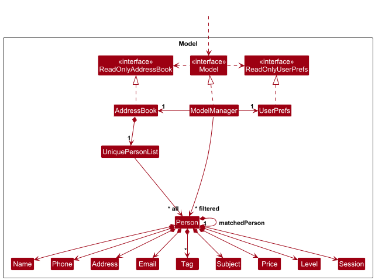
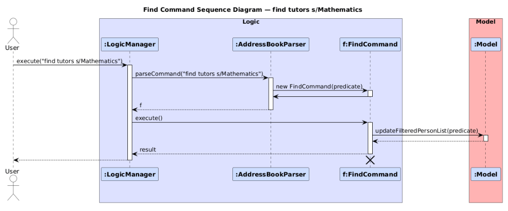
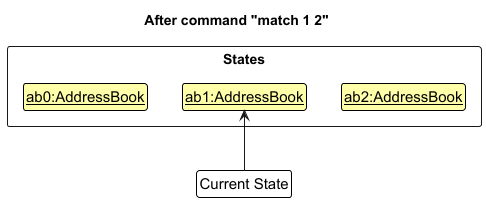
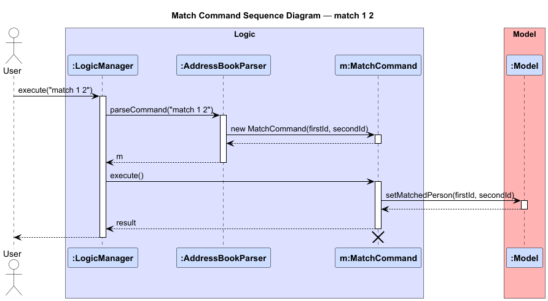

* Table of Contents
{:toc}

--------------------------------------------------------------------------------------------------------------------

## **Acknowledgements**

* This project is adapted from the original AddressBook Level 3 (AB3)
  project created by the SE-EDU initiative
  .
  We would like to acknowledge and thank the following sources and contributors whose work formed the foundation of this project.
* Documentation adapted from SE-EDU’s User Guide
  and Developer Guide
--------------------------------------------------------------------------------------------------------------------

## **Setting up, getting started**

Refer to the guide [_Setting up and getting started_](SettingUp.md).

--------------------------------------------------------------------------------------------------------------------

## **Design**

<div markdown="span" class="alert alert-primary">

:bulb: **Tip:** The `.puml` files used to create diagrams are in this document `docs/diagrams` folder. Refer to the [_PlantUML Tutorial_ at se-edu/guides](https://se-education.org/guides/tutorials/plantUml.html) to learn how to create and edit diagrams.
</div>

### Architecture


The ***Architecture Diagram*** given above explains the high-level design of the App.

Given below is a quick overview of main components and how they interact with each other.

**Main components of the architecture**

**`Main`** (consisting of classes [`Main`](https://github.com/se-edu/addressbook-level3/tree/master/src/main/java/seedu/address/Main.java) and [`MainApp`](https://github.com/se-edu/addressbook-level3/tree/master/src/main/java/seedu/address/MainApp.java)) is in charge of the app launch and shut down.
* At app launch, it initializes the other components in the correct sequence, and connects them up with each other.
* At shut down, it shuts down the other components and invokes cleanup methods where necessary.

The bulk of the app's work is done by the following four components:

* [**`UI`**](#ui-component): The UI of the App.
* [**`Logic`**](#logic-component): The command executor.
* [**`Model`**](#model-component): Holds the data of the App in memory.
* [**`Storage`**](#storage-component): Reads data from, and writes data to, the hard disk.

[**`Commons`**](#common-classes) represents a collection of classes used by multiple other components.

**How the architecture components interact with each other**

The *Sequence Diagram* below shows how the components interact with each other for the scenario where the user issues the command `delete 1`.


Each of the four main components (also shown in the diagram above),

* defines its *API* in an `interface` with the same name as the Component.
* implements its functionality using a concrete `{Component Name}Manager` class (which follows the corresponding API `interface` mentioned in the previous point.

For example, the `Logic` component defines its API in the `Logic.java` interface and implements its functionality using the `LogicManager.java` class which follows the `Logic` interface. Other components interact with a given component through its interface rather than the concrete class (reason: to prevent outside component's being coupled to the implementation of a component), as illustrated in the (partial) class diagram below.


The sections below give more details of each component.

### UI component

The **API** of this component is specified in [`Ui.java`](https://github.com/se-edu/addressbook-level3/tree/master/src/main/java/seedu/address/ui/Ui.java)


The UI consists of a `MainWindow` that is made up of parts e.g.`CommandBox`, `ResultDisplay`, `PersonListPanel`, `StatusBarFooter` etc. All these, including the `MainWindow`, inherit from the abstract `UiPart` class which captures the commonalities between classes that represent parts of the visible GUI.

The `UI` component uses the JavaFx UI framework. The layout of these UI parts are defined in matching `.fxml` files that are in the `src/main/resources/view` folder. For example, the layout of the [`MainWindow`](https://github.com/se-edu/addressbook-level3/tree/master/src/main/java/seedu/address/ui/MainWindow.java) is specified in [`MainWindow.fxml`](https://github.com/se-edu/addressbook-level3/tree/master/src/main/resources/view/MainWindow.fxml)

The `UI` component,

* executes user commands using the `Logic` component.
* listens for changes to `Model` data so that the UI can be updated with the modified data.
* keeps a reference to the `Logic` component, because the `UI` relies on the `Logic` to execute commands.
* depends on some classes in the `Model` component, as it displays `Person` object residing in the `Model`.

### Logic component

**API** : [`Logic.java`](https://github.com/se-edu/addressbook-level3/tree/master/src/main/java/seedu/address/logic/Logic.java)

Here's a (partial) class diagram of the `Logic` component:


The sequence diagram below illustrates the interactions within the `Logic` component, taking `execute("delete 1")` API call as an example.


<div markdown="span" class="alert alert-info">:information_source: **Note:** The lifeline for `DeleteCommandParser` should end at the destroy marker (X) but due to a limitation of PlantUML, the lifeline continues till the end of diagram.
</div>

How the `Logic` component works:

1. When `Logic` is called upon to execute a command, it is passed to an `AddressBookParser` object which in turn creates a parser that matches the command (e.g., `DeleteCommandParser`) and uses it to parse the command.
1. This results in a `Command` object (more precisely, an object of one of its subclasses e.g., `DeleteCommand`) which is executed by the `LogicManager`.
1. The command can communicate with the `Model` when it is executed (e.g. to delete a person).<br>
   Note that although this is shown as a single step in the diagram above (for simplicity), in the code it can take several interactions (between the command object and the `Model`) to achieve.
1. The result of the command execution is encapsulated as a `CommandResult` object which is returned back from `Logic`.

Here are the other classes in `Logic` (omitted from the class diagram above) that are used for parsing a user command:


How the parsing works:
* When called upon to parse a user command, the `AddressBookParser` class creates an `XYZCommandParser` (`XYZ` is a placeholder for the specific command name e.g., `AddCommandParser`) which uses the other classes shown above to parse the user command and create a `XYZCommand` object (e.g., `AddCommand`) which the `AddressBookParser` returns back as a `Command` object.
* All `XYZCommandParser` classes (e.g., `AddCommandParser`, `DeleteCommandParser`, ...) inherit from the `Parser` interface so that they can be treated similarly where possible e.g, during testing.

### Model component
**API** : [`Model.java`](https://github.com/se-edu/addressbook-level3/tree/master/src/main/java/seedu/address/model/Model.java)




The `Model` component,

* stores the ConnectEd data i.e., all `Person` objects (which are contained in a `UniquePersonList` object).
* stores the currently 'selected' `Person` objects (e.g., results of a search query) as a separate _filtered_ list which is exposed to outsiders as an unmodifiable `ObservableList<Person>` that can be 'observed' e.g. the UI can be bound to this list so that the UI automatically updates when the data in the list change.
* stores a `UserPref` object that represents the user’s preferences. This is exposed to the outside as a `ReadOnlyUserPref` objects.
* does not depend on any of the other three components (as the `Model` represents data entities of the domain, they should make sense on their own without depending on other components)

### Storage component

**API** : [`Storage.java`](https://github.com/se-edu/addressbook-level3/tree/master/src/main/java/seedu/address/storage/Storage.java)


The `Storage` component,
* can save both address book data and user preference data in JSON format, and read them back into corresponding objects.
* inherits from both `AddressBookStorage` and `UserPrefStorage`, which means it can be treated as either one (if only the functionality of only one is needed).
* depends on some classes in the `Model` component (because the `Storage` component's job is to save/retrieve objects that belong to the `Model`)

### Common classes

Classes used by multiple components are in the `seedu.address.commons` package.

--------------------------------------------------------------------------------------------------------------------

## **Implementation**

This section describes some noteworthy details on how certain features are implemented.

### **List Feature**

#### Implementation Details

The `ListCommand` allows users to display all **tutors**, **students**, or **all persons** currently stored in the address book.  
It serves as a core navigation command that resets the filtered list view based on the specified role.

1. **Parsing:**  
   The `ListCommandParser` validates that:
    * The role is one of `"tutors"`, `"students"`. The role is case-insensitive.
    * If no argument is provided, it defaults to show all the persons.
    * If an invalid argument is provided, a `ParseException` is thrown with a usage message:
      ```
      Invalid command format!
      list: Lists all tutors or students and displays them as a list with index numbers.
      Parameter: 'tutors' / 'students'
      ```

2. **Filtering:**  
   Before listing, the command updates the filtered person list using the appropriate predicate:
    * `Model#updateFilteredPersonList(PREDICATE_SHOW_ALL_TUTORS)` – for `"tutors"`.
    * `Model#updateFilteredPersonList(PREDICATE_SHOW_ALL_STUDENTS)` – for `"students"`.
    * `Model#updateFilteredPersonList(PREDICATE_SHOW_ALL_PERSONS)` – for `"all"`.

   These predicates are predefined in the `Model` and ensure that the displayed list in the GUI reflects the selected category.

3. **Execution:**  
   The `ListCommand#execute()` method:
    * Calls the relevant predicate based on the role.
    * Refreshes the UI list to display the filtered persons.
    * Returns a `CommandResult` containing a role-specific success message:
        * `"Listed all tutors and students."`
        * `"Listed all tutors."`
        * `"Listed all students."`

4. **Integration with UI:**
    * The updated filtered list is bound to the GUI through JavaFX’s `ObservableList`.
    * The UI automatically refreshes to show the updated list without requiring manual refresh actions.
    * The command box clears after successful execution, consistent with other CLI commands.

#### Error Handling

The `ListCommand` handles several error cases gracefully:

1. **Invalid role:**  
   If the user specifies an invalid role (e.g., `list tutor` instead of `list tutors`), a `ParseException` is thrown with the correct usage message.

2. **Extra parameters:**  
   If additional arguments or prefixes are provided (e.g., `list tutors p/`), the parser rejects the input and shows the usage error.

---

#### Design Considerations

**Aspect: Command Structure**

* **Alternative 1 (current choice):** Use a single `ListCommand` class with a role parameter (`tutors`, `students`).
    * Pros: Simple, reduces code duplication, centralized command behavior.
    * Cons: Requires argument parsing logic and role validation.

* **Alternative 2:** Create separate commands (`ListTutorsCommand`, `ListStudentsCommand`, etc.).
    * Pros: Each command is simpler and self-contained.
    * Cons: More boilerplate classes; harder to maintain consistency across variants.

---

#### Example Usage

| Command | Description | Expected Result |
|--------|--------------|----------------|
| `list` | Displays all persons (tutors and students). | Full list shown in UI. |
| `list tutors` | Displays all tutors in the address book. | Tutor list shown in UI. |
| `list students` | Displays all students in the address book. | Student list shown in UI. |


### Find feature

#### Implementation

The **Find feature** allows users to search for **tutors** or **students** in the database based on one or more criteria such as name, subject, level, or price range.

The mechanism is facilitated by the `FindCommand` class.  
It is constructed by the `FindCommandParser` inside the `AddressBookParser`.  
When executed, it updates the filtered list in the `Model` using a combined predicate built from user-specified filters.

These operations are exposed in the `Logic` and `Model` components as `LogicManager#execute()`, `AddressBookParser#parseCommand()`, and `Model#updateFilteredPersonList()` respectively.

Given below is an example usage scenario and how the find mechanism behaves at each step.


##### Step 1. User executes the `find` command

The user enters the command below in the command box: eg `"find tutors sbj/Mathematics"`

The `LogicManager` passes this string to `AddressBookParser#parseCommand("find tutors sbj/Mathematics")`.

The `AddressBookParser` identifies the keyword `find` and delegates parsing to the `FindCommandParser`.


##### Step 2. `FindCommandParser` processes the arguments

The `FindCommandParser` performs the following actions:

* Extracts the **role** (`tutors` or `students`) from the preamble if present.
* Tokenizes the remaining arguments using the prefixes `n/`, `sbj/`, `l/`, and `p/`.
* Parses and validates each argument value.
* Creates individual predicates such as  
  `NameContainsKeywordsPredicate`, `MatchingSubjectPredicate`,  
  `MatchingLevelPredicate`, and `MatchingPricePredicate`.
* Combines these predicates with logical AND to form one composite predicate.

After successful parsing, the parser returns a new `FindCommand` containing this composite predicate.

##### Step 3. `FindCommand` execution

When the `LogicManager` calls `FindCommand#execute(Model model)`,  
the command filters the current person list according to the predicate:

```java
@Override
public CommandResult execute(Model model) {
    requireNonNull(model);
    model.updateFilteredPersonList(predicate);
    return new CommandResult(
            String.format(Messages.MESSAGE_PERSONS_LISTED_OVERVIEW, model.getFilteredPersonList().size()));
}
```
##### Step 4. Model updates the filtered list

The Model receives the request through `updateFilteredPersonList(predicate)` and applies the predicate to its stored list of persons.
The updated filtered list is automatically reflected in the UI panel.

##### Step 5. Command execution summary
The following sequence diagram shows how a find operation goes through the Logic component:

:information_source: **Note:** The lifeline for `FindCommand` should end at the destroy marker (X) but due to a limitation of PlantUML, the lifeline reaches the end of diagram.
#### Design considerations:

##### Aspect: How filtering evolved from AB3

* **Alternative 1 (previous AB3 implementation)**: Single-prefix search using only `NameContainsKeywordsPredicate`.
    * **Pros:** Simple and fast, performs a basic name-based keyword search.
    * **Cons:** Limited and cannot filter by subjects, levels, prices, or distinguish tutors from students.

* **Alternative 2 (current choice)**: Enhanced `FindCommand` supporting multiple prefixes (`n/`, `s/`, `l/`, `p/`) and optional roles (`tutors`, `students`).
    * **Pros:** Far more flexible and supports complex searches like `find tutors sbj/Mathematics l/4 p/10-30`. Uses modular predicates for each attribute.
    * **Cons:** Slightly more complex parser and predicate logic, higher validation overhead.

##### Aspect: How logical conditions are applied

* **Alternative 1 (previous AB3 implementation)**: Used only **OR** matching across names.
    * **Pros:** Simple and intuitive for name-based search.
    * **Cons:** Not suitable for combining multiple filters, e.g., searching by subject *and* level simultaneously.

* **Alternative 2 (current choice)**: Applies **AND logic** between different prefixes and **OR logic** within a single prefix.
    * **Pros:** Allows precise, realistic filtering (e.g., tutors teaching Math **and** Level 4). Matches user expectations.
    * **Cons:** Slightly more complex to implement due to multiple predicate combinations.

---


### Match/Unmatch Feature

#### Implementation

The match/unmatch mechanism is facilitated by `MatchCommand` and `UnmatchCommand`. It establishes or removes bidirectional references between a tutor and a student, ensuring one-to-one matching relationships.

* `MatchCommand#execute()` — Creates a bidirectional match between a tutor and student, updating both entities.
* `UnmatchCommand#execute()` — Removes the bidirectional match between a tutor and student.
* `MatchCommandParser#parse()` — Parses and validates user input to create a valid `MatchCommand` with tutor and student indices.
* `UnmatchCommandParser#parse()` — Parses user input to create a valid UnmatchCommand with either tutor or student index.

These operations interact with the `Model` interface through `Model#matchTutorStudent()` and `Model#unmatchTutorStudent()` to maintain referential integrity.

Given below is an example usage scenario and how the match/unmatch mechanism behaves at each step.

Step 1. The user launches the application. The application displays a unified list containing both tutors and students, none of which are matched initially.


Step 2. The user executes `match 1 2` command to match the first person which is a tutor with the second person who is a student. The `MatchCommandParser` validates the input, checks that both indices are valid and visible in the current filtered list, and creates a `MatchCommand`. The command executes and calls `Model#setMatchedPerson()`, which:
* Verifies neither tutor nor student is already matched to someone else
* Creates bidirectional references between the tutor and student
* Updates the GUI to display the match information in both entities' profiles


<div markdown="span" class="alert alert-info">:information_source: **Note:** If a match command fails validation or execution (e.g., invalid index, entity already matched), the command will not modify any state. The user will see an appropriate error message.


</div>

Step 3. The user realizes the match was incorrect and executes `unmatch 1` to remove the match. The `UnmatchCommandParser` validates the input and creates an `UnmatchCommand`. The command executes and calls `Model#unsetMatchedPerson()`, which:
* Retrieves the matched pair from the specified entity
* Removes bidirectional references from both tutor and student
* Updates the GUI to remove match information from both profiles

Step 4. The user executes `match 1 2` to create a new match. Since both entities are now unmatched, the operation succeeds and establishes the new bidirectional relationship.

The following sequence diagram shows how a match operation goes through the `Logic` component:



<div markdown="span" class="alert alert-info">:information_source: **Note:** The lifeline for `MatchCommand` should end at the destroy marker (X) but due to a limitation of PlantUML, the lifeline reaches the end of diagram.


</div>

#### Design considerations:

**Aspect: One-to-one vs one-to-many matching:**

* **Alternative 1 (current choice):** One-to-one matching (each tutor can only match with one student and vice versa).
    * Pros: Simple to implement and understand. Prevents ambiguity in match status. Easier to maintain referential integrity. Reflects real-world tuition arrangements where one tutor typically has dedicated time slots for specific students.
    * Cons: Less flexible if a tutor wants to teach multiple students simultaneously. Requires unmatch before creating new match.

* **Alternative 2:** One-to-many matching (tutors can match with multiple students).
    * Pros: More flexible for tutors who teach group sessions. Better reflects scenarios where one tutor handles multiple students.
    * Cons: Significantly more complex implementation. Harder to maintain data consistency. More complex UI to display multiple matches. Deletion becomes more complicated (need to handle cascading unmatches).

**Aspect: How to handle already-matched entities:**

* **Alternative 1 (current choice):** Reject and require explicit unmatch first.
    * Pros: Prevents accidental overwriting of matches. Forces user to consciously remove existing match. Clearer audit trail of operations. Prevents data loss.
    * Cons: Requires two commands to reassign a match (unmatch then match).

* **Alternative 2:** Automatically unmatch and rematch in one command.
    * Pros: More convenient for users - single command to reassign. Fewer steps for common operation.
    * Cons: Risk of accidental match reassignment. Harder to undo mistakes. Less transparent to user what happened to previous match. Could cause confusion.

### Recommend feature

#### Implementation

The recommend mechanism is facilitated by `RecommendCommand` and its associated predicate classes. It recommends persons in the person list based on specified criteria (subject, level, or price range) and displays matching results.

* `RecommendCommand#execute()` — Executes the recommend operation by applying the appropriate predicate to filter the list.
* `RecommendCommandParser#parse()` — Parses and validates user input to create a valid `RecommendCommand`.

These operations interact with the `Model` interface through `Model#getFilteredPersonList()` to updates the filtered person list, which is then displayed to the user as recommendations.

Given below is an example usage scenario and how the recommend mechanism behaves at each step.

Step 1. The user launches the application for the first time. The application displays the full list of tutors and students.

Step 2. The user executes `recommend 2 sbj/` command to find tutors/students matching the subject of the student/tutor. The `RecommendCommandParser` validates the input and creates a `RecommendCommand`. The command retrieves the specified user, constructs a predicate based on the user's subject requirement, and applies it using `Model#updateFilteredPersonList(predicate)` to display recommended tutors matching the criteria.

<div markdown="span" class="alert alert-info">:information_source: **Note:** If a recommend command fails validation (e.g., invalid parameters), the `RecommendCommandParser` will throw a `ParseException`, and the command will not execute. The user will see an appropriate error message.

</div>

#### Design considerations:

**Aspect: How recommendations are generated:**

* **Alternative 1 (current choice):** Use JavaFX FilteredList with dynamically constructed predicates based on the selected user's requirements (subject, level, price).
  * Pros: Efficient, leverages JavaFX's built-in filtering and automatic UI updates. Predicate logic is modular and reusable. Recommendations are always up-to-date with the latest criteria.
  * Cons: Recommendations are stateless, each new recommend command replaces the previous filter and results.

* **Alternative 2:** Maintain a separate recommended list for each user.
  * Pros: Allows caching and quick retrieval of previous recommendations. Could support multiple recommendation sets per user.
  * Cons: More complex implementation. Requires manual synchronization with source data. Higher memory usage and risk of stale recommendations.

**Aspect: How to handle empty results:**

* **Alternative 1 (current choice):** Display appropriate message, keep filter applied.
  * Pros: User understands why list is empty. Clear feedback on search outcome.
  * Cons: User must execute `list tutors/students` to see full list again.

* **Alternative 2:** Automatically reset to full list when no results found.
  * Pros: User always sees something in the list.
  * Cons: Confusing user experience - unclear whether search executed successfully or was ignored.

### Sort Feature

#### Implementation

The sort mechanism is facilitated by `SortCommand`, which allows users to sort tutors or students by specified criteria (price and/or level). The sorting supports:
* Single criterion sorting (e.g., by price only)
* Multi-criterion sorting with priority order (e.g., by price first, then by level)
* Separate sorting for tutors and students 
* Reset functionality to clear all filters and show all persons

#### Key Components
* `SortCommand`- Executes the sorting operation
* `SortCommandParser`- Parses user input and creates `SortCommand` objects
* `Model#sortPersons(List<String>)`- Applies the sort to the filtered person list
* `ModelManager#getComparatorForCriteria(String)`- Creates comparators for each sort criterion
* `AddressBook#sortPersons(Comparator<Person>)`- Performs the actual sorting on the person list

The sort operation interacts with the `Model` interface through `Model#sortPersons(List<String>)` to sort the person list and `Model#updateFilteredPersonList(Predicate<Person>)` to filter by role

Given below is an example usage scenario and how the sort mechanism behaves at each step.

**Step 1.** The user launches the application for the first time. The application displays the full list of tutors and students in the order they were added to the address book.

**Step 2.** The user executes `list tutors` to view only tutors. The `ListCommand` calls `Model#updateFilteredPersonList(PREDICATE_SHOW_ALL_TUTORS)` to filter the displayed list to show only tutors.

**Step 3.** The user notices that tutors are not organized by price and wants to find affordable options. The user executes `sort tutors p/` command to sort tutors by their hourly rates. The `SortCommandParser` validates the input (checking that "tutors" is a valid role and "p/" is a valid field) and creates a `SortCommand` with role "tutors" and sort criteria ["p/"]. The command executes and performs the following:
    1. Calls `Model#updateFilteredPersonList(PREDICATE_SHOW_ALL_TUTORS)` to ensure only tutors are displayed
    2. Calls `Model#sortPersons(["p/"])` which creates a comparator for price
    3. The comparator sorts tutors in ascending order by their minimum price value
    4. Returns a success message: "Sorted all tutors by price"
The tutors are now displayed sorted by price from lowest to highest.
<div markdown="span" class="alert alert-info">:information_source: **Note:** If a sort command fails validation (e.g., invalid role like "tutor" instead of "tutors", invalid field like "x/", or duplicate fields like "p/ p/"), the `SortCommandParser` will throw a `ParseException`, and the command will not execute. The user will see an appropriate error message.
</div>

**Step 4.** The user wants to further refine the sorting by also considering education level. The user executes `sort tutors p/ l/` to sort by price first, then by level. The `SortCommand` creates a chained comparator that first compares by price, then by level for tutors with the same price. Tutors are now organized with the most affordable at the top, and within each price range, sorted by education level.

<div markdown="span" class="alert alert-info">:information_source: **Note:** The sorted order persists across subsequent commands within the same session. For example, if the user executes `list tutors` again after sorting, the tutors will still be displayed in the sorted order. The sorting is only reset when the application is restarted or when a new sort command is executed with different criteria.
</div>

**Step 5.** The user executes `list students` to switch to viewing students. Since the sort was applied only to tutors, students are displayed in their original unsorted order.

**Step 6.** The user executes `sort students l/ p/` to sort students by level first, then by price. Students are now organized by education level, with students at lower levels appearing first, and within each level, sorted by their budget (price range).

**Step 7.** The user wants to return to viewing all persons without any filters. The user executes `sort reset` to clear all filters. The command calls `Model#updateFilteredPersonList(PREDICATE_SHOW_ALL_PERSONS)` to display both tutors and students in their original order.

#### Implementation Details
1. **Parsing:** `SortCommandParser` validates that:
    * The role is either "tutors" or "students" or "reset"
    * If role is "reset", no additional parameters are allowed
    * All field are either "p/" or "l/"
    * There are no duplicate fields
2. **Filtering:** Before sorting, the command:
    * Preserves existing filters using `Model#getFilterPredicate()`
    * Combines existing filters with the role predicate (tutors/students) using AND logic
    * For reset, applies `PREDICATE_SHOW_ALL_PERSONS` to clear all filters
3. **Comparator Chaining:** Multiple sort criteria are handled by chaining comparators
4. **Range Handling:** For level and price fields that support ranges (e.g., "1-3" or "20-30"), the comparator uses the first number for sorting

#### Error Handling
The sort command handles several error cases:
1. **Invalid role:** Returns parse exception if role is not "tutors" or "students"
2. **Invalid field:** Returns parse exception if field is not "p/" or "l/"
3. **Duplicate fields:** Returns parse exception with message indicating which field is duplicated 
4. **Missing parameters:** Returns parse exception if role or fields are not provided 
5. **Empty list:** Returns appropriate message if the address book is empty or no tutors/students found
6. **Reset with extra parameters:** Returns error if "reset" is provided with additional parameters

#### Design Considerations
**Aspect: How sorting is performed**

* **Alternative 1 (current choice):** Sort the underlying `ObservableList` in place
  * Pros: Changes automatically propagate to the UI through JavaFX bindings; simple implementation
  * Cons: Modifies the original data structure permanently (within the session); sorting affects all views

* **Alternative 2:** Create a sorted view without modifying the underlying list
    * Pros: Preserves original order; allows multiple sorted views
    * Cons: More complex implementation; requires additional data structures

**Aspect: Sorting by ranges (Level and Price)**

* **Alternative 1 (current choice):** Use the first number in hyphenated ranges (e.g., 20-30 -> 20)
    * Pros: Simple and predictable behaviour; works consistently for both single values and ranges
    * Cons: May not represent the "true" value for ranges (doesn't use midpoint or average)

* **Alternative 2:** Calculate midpoint or average of ranges 
    * Pros: More accurate representation of range values
    * Cons: More complex logic; may be unintuitive for users

**Aspect: How to handle existing filters when sorting**

* **Alternative 1 (current choice):** Preserve existing filters and combine with role filter
    * Pros: More intuitive - users don't lose their previous filter state; allows sorting within filtered results
    * Cons: More complex logic to track and combine predicates; may confuse users if they forgot about existing filters

* **Alternative 2:** Clear all filters before applying sort
    * Pros: Simpler implementation; clearer state - users always know exactly what they're viewing
    * Cons: Users lose their filter context; would need to reapply filters after sorting

**Aspect: How to implement reset functionality**

* **Alternative 1 (current choice):** Include reset as a special role value in SortCommand
    * Pros: Consistent command structure; single command handles both sorting and resetting
    * Cons: Role parameter becomes overloaded (represents both role types and a command action)

* **Alternative 2:** Create a separate ResetCommand
    * Pros: Cleaner separation of concerns; role parameter stays semantic
    * Cons: Additional command class; inconsistent with user mental model (reset is related to viewing/sorting)

* **Alternative 3:** Use existing list command to reset
    * Pros: No new command needed; users already familiar with list
    * Cons: List command already has specific role-based behavior; reset clears filters while list applies them

**Aspect: Handling empty lists and no results found**

* **Alternative 1 (current choice):** Check for empty list first, then check for empty filtered list after applying predicates
    * Pros: Provides specific, helpful error messages for different scenarios; better UX
    * Cons: Multiple checks needed; slightly more complex logic

* **Alternative 2:** Only check after filtering and show generic "no results" message
    * Pros: Simpler implementation; single check
    * Cons: Less informative to users; doesn't distinguish between empty database and no matches

### Stats Feature
#### Implementation

The statistics feature is implemented via `StatsCommand` and `StatsCommandParser`. It provides a summary of key metrics (counts, averages) to help coordinators assess the database at a glance.

#### Key Components
- `StatsCommand#execute()` — Retrieves aggregated statistics from the Model and formats them for display.

- `StatsCommandParser#parse()` — Parses optional filters (e.g., role/ tutors or role/ students) and constructs a `StatsCommand`.

- `Model#getStatistics(Optional<Role> role) `— Computes and returns a Statistics object containing (at minimum):

  * Total tutors and students 
  * Subject distribution
  * Average hourly price (tutors) / average budget (students)
  * Number of matched pairs


No underlying data is modified by this command.

--------------------------------------------------------------------------------------------------------------------

## **Documentation, logging, testing, configuration, dev-ops**

* [Documentation guide](Documentation.md)
* [Testing guide](Testing.md)
* [Logging guide](Logging.md)
* [Configuration guide](Configuration.md)
* [DevOps guide](DevOps.md)

--------------------------------------------------------------------------------------------------------------------

## **Appendix: Requirements**

### Product scope

**Target user profile: Tuition coordinators**

This app is designed for tuition coordinators who 
* Work with **primary school students** and freelance tutors teaching core subjects (**English, Mathematics, Science**).
* Prefer **efficient, keyboard-driven workflows** over graphical interfaces.
* Need to **add, find, match, recommend, and sort** tutors and students quickly using command-line inputs.
* Handle multiple records at once and need **accurate filters** for subject, level, and price.
* Use **desktop devices (Windows/macOS/Linux)** with **Java 17+**.

**Value proposition**:  
A command-line application designed for **tuition coordinators** to efficiently manage tutor–student matching.  
It allows fast, validated entry and searching of data with **logical filtering, matching, recommending, and sorting**, far more reliable and scalable than spreadsheets or manual tracking.

---

### User stories

Priorities: High (must have) 
`* * *` Medium (nice to have) 
`* *` Low (optional) `*`

| Priority | As a … | I want to …                                                           | So that I can …                                                                         |
|---------|---------|-----------------------------------------------------------------------|-----------------------------------------------------------------------------------------|
| `* * *` | tuition coordinator | **add** a *student* with name, phone, address, subject, level, and price | record student requests systematically                                                  |
| `* * *` | tuition coordinator | **add** a *tutor* with name, phone, address, subject, level(s), and price | maintain an updated list of available tutors                                            |
| `* * *` | tuition coordinator | **list** all *tutors* or *students*                                   | view one role category at a time for clarity                                            |
| `* * *` | tuition coordinator | **find** tutors/students by **name, subject, level, or price**        | identify suitable tutors or students efficiently                                        |
| `* * *` | tuition coordinator | **match** a tutor with a student                                      | confirm successful tuition pairings                                                     |
| `* * *` | tuition coordinator | **unmatch** a tutor or student                                        | correct pairing mistakes or cancellations quickly                                       |
| `* * *` | tuition coordinator | **delete** a tutor or student entry                                   | remove outdated records                                                                 |
| `* * *` | tuition coordinator | **sort** tutors or students by **price** or **level**                 | compare affordability and experience easily                                             |
| `* *` | tuition coordinator | **add a session** to a tutor and student                              | see what are the details of the arranged tuition session between student and tutor      |
| `* *` | tuition coordinator | **recommend** tutors to a student, or students to a tutor             | receive automated personal suggestions based on subject, level, and price compatibility |
| `* *` | tuition coordinator | view **clear error messages** for invalid commands                    | fix mistakes easily and continue working                                                |
| `* *` | tuition coordinator | prevent adding **duplicate entries**                                  | ensure data remains clean and accurate                                                  |
| `*` | tuition coordinator | **edit** tutor or student details                                     | update information without re-adding                                                    |
| `*` | tuition coordinator | **reset** the current filter view                                     | return to the complete tutor/student list                                               |

### Use cases

(For all use cases below, the **System** is the `ConnectEd` and the **Actor** is the `user`, unless specified otherwise)

**Use case: Add a student/tutor**

**MSS**

1. User requests to add a person by providing role (tutor/student), name, phone, address, subject, level, and price.
2. ConnectEd validates all fields.
3. ConnectEd adds the new person to the database.
4. ConnectEd shows a success message and the updated list.
Use case ends.

**Extensions**

* 2a. One or more fields are missing or in the wrong format.

    ConnectEd shows an error message indicating invalid command format.

    Use case resumes at step 1 with corrected input.

* 2b. A duplicate person (same role, same name, same phone) exists.
  ConnectEd rejects the add and shows a duplicate warning.

    Use case ends.

* 2c. Invalid data format (Subject, Price, Level).
  ConnectEd rejects the add and shows correct data format to be inputted.

  Use case resumes at step 1 with corrected input.


* 3a. Storage fails (e.g., I/O error).
  * 3a1. ConnectEd shows “Error saving data: add”.

    Use case ends.

---

**Use case: List tutors/students, or both**

**MSS**

1. User requests to list either tutors or students, or both.

2. ConnectEd shows the requested list with indices.

   Use case ends.

**Extensions**

* 1a. The parameter is invalid.
    * 1a1. ConnectEd shows “Invalid command format!
      list: Lists all tutors or students and displays them as a list with index numbers.
      Parameter: 'tutors' / 'students'”.
        
        Use case ends.

---

**Use case: Find tutors/students (by name / subject / level / price)**

**MSS**

1. User enters a `find` command with an optional role (`tutors` or `students`) and one or more filters using prefixes `n/`, `sbj/`, `l/`, or `p/`.  
   Example: `find tutors sbj/ Mathematics l/ 2-4 p/ 20-40`

2. ConnectEd validates all inputs and formats (role, prefixes, and field values).

3. ConnectEd constructs and combines all matching predicates (Role, Name, Subject, Level, Price).

4. ConnectEd updates the list to show all persons matching the given criteria.

   Use case ends.

**Extensions**

* 2a. No valid prefixes or empty values (e.g. `n/ `, `sbj/ `).
    * 2a1. ConnectEd shows corresponding error message.  
      Use case ends.

* 2b. Invalid role.
    * 2b1. ConnectEd shows corresponding error message.
  
      Use case ends

* 2c. Invalid or malformed values (e.g. `p/250`, `l/7-2`, invalid subject).
    * 2c1. ConnectEd shows the corresponding validation message.  
      Use case ends.

* 3a. No persons match the filters.
    * 3a1. ConnectEd shows "No persons match your search."
     Use case ends.
  
* 3b. Empty list
  * 3b1. ConnectEd shows "List is empty, there is no persons to find."

    Use case ends.

---

**Use case: Match a tutor to a student**

**Preconditions: At least one tutor and one student exist.**

**Guarantees: On success, both sides reflect a bidirectional match.**

**MSS**

1. User requests to match using visible indices: match `<Id>` `<Id>`.

2. ConnectEd validates both Ids against the list of persons.

3. ConnectEd checks that neither party is already matched.

4. ConnectEd links the tutor and student (one-to-one) and updates both profiles.

5. ConnectEd shows success message (e.g., “Matched student Josh Low (id: #2) with tutor Aaron Tan (id: #1)”).

    Use case ends.

**Extensions**

* 2a. Either person Id is invalid/out of range.
  * 2a1. ConnectEd shows a person Id error . "Person with id #x not found."
  
    Use case resumes at step 1.

* 3a. Tutor or student is already matched.
  * 3a1. ConnectEd shows “One or both persons are already matched.” User is required to unmatch first.
  
    Use case ends.

* 4a. No tutors or students exist.
  * 4a1. ConnectEd shows “There are no tutors and students to match!”.
  
    Use case ends.

---

**Use case: Unmatch a tutor and student**

**Preconditions: The specified tutor or student is currently matched.**

**Guarantees: On success, neither side remains matched.**

**MSS**

1. User requests to unmatch by specifying one side: unmatch `<Id of tutor>` or unmatch `<Id of student>`.

2. ConnectEd validates the person Id against the list of persons.

3. ConnectEd verifies there is a linked counterpart.

4. ConnectEd removes the bidirectional link and updates both profiles.

5. ConnectEd shows success message (e.g., “Unmatched tutor Aaron Tan (id: #1) and student Josh Low (id: #2).”).

    Use case ends.

**Extensions**

* 2a. Index invalid/out of range.
  * 2a1. ConnectEd shows a role-specific index error.
  
    Use case resumes at step 1.

* 3a. The specified person is not matched.
  * 3a1. ConnectEd shows error message “Person with id #x is not currently matched with anyone.”
    
    Use case ends.

---

**Use case: Delete a person (tutor/student)**

**Preconditions: If matched, the person must be unmatched first.**

**Guarantees: On success, the person is removed and indices are re-numbered.**

**MSS**

1. User requests to delete a specific person using index: delete `<INDEX>`

2. ConnectEd validates the index.

3. ConnectEd confirms the person is not currently matched.

4. ConnectEd deletes the person and updates the list.

5. ConnectEd shows a success message and the refreshed list.

    Use case ends.

**Extensions**

* 2a. Wrong format.
  * 2a1. ConnectEd shows error message “Invalid command format! ”.

    Use case ends.

* 2b. Index invalid/out of range.
  * 2b1. ConnectEd shows error message “The person index provided is invalid”.

    Use case ends.

* 3a. Person is matched.
  * 3a1. ConnectEd shows “Cannot delete this person because they are currently matched.
    Please unmatch them first.”.

    Use case ends.

---

**Use case: Recommend tutors to a student / students to a tutor**

**Preconditions: At least one tutor and one student exist in the database.**

**Guarantees: On success, the user receives a list of recommended tutors for a student, or students for a tutor, based on subject, level, and price compatibility.**
**MSS**
1. User requests recommendations for a person using `recommend <INDEX> [subject] [level] [price]` (e.g., `recommend 1 /s /l`).
2. ConnectEd validates the index and checks that it refers to a valid person in the current list.
3. ConnectEd retrieves the profile of the specified student/tutor.
4. ConnectEd determines the role (student or tutor) and applies the relevant filters:
    * For students: recommends tutors matching subject, level, and price.
    * For tutors: recommends students matching subject, level, and price.
    * If no flags are specified, all requirements are used.
5. ConnectEd displays a ranked list of recommended tutors (for a student) or students (for a tutor), with indices and key details.

    Use case ends.

**Extensions**

* 2a. Index is invalid/out of range/not visible.
    * 2a1. ConnectEd shows "The person index provided is invalid"
    Use case ends.

---

**Use case: Save data (automatic)**

**MSS**

1. User executes a data-changing command (e.g., add, match, unmatch, delete).

2. ConnectEd persists the updated data to disk automatically.

    Use case ends.

**Extensions**

* 2a. Data file missing or corrupted on first run.
  * 2a1. ConnectEd shows “No/Corrupted data found, creating new data file”.
  * 2a2. ConnectEd creates a new empty data file.
    
    Use case ends.

* 2b. Storage failure.
  * 2b1. ConnectEd shows “Error saving data: <command>”.
    
    Use case ends.

**Use case: Exit application**

**MSS**

1. User requests to exit the application.

2. ConnectEd ensures all pending data is saved.

3. ConnectEd closes the application.

    Use case ends.

**Extensions**

* 2a. Save fails during exit.
  * 2a1. ConnectEd shows “Error: Unable to exit application”.
  * 2a2. ConnectEd remains open so the user can retry or back up data.
  
    Use case ends.
### Non-Functional Requirements

1.  Should work on any _mainstream OS_ as long as it has Java `17` or above installed.
2.  Should be able to hold up to 1000 persons (500 tutors and 500 students) without a noticeable sluggishness in performance for typical usage.
3.  A user with above average typing speed for regular English text (i.e. not code, not system admin commands) should be able to accomplish most of the tasks faster using commands than using the mouse.
4.  Should respond to any command within 2 seconds under normal load conditions.
5.  Should provide clear and specific error messages for all invalid inputs, guiding users toward correct command format.
6.  Should prevent all duplicate entries as defined by the duplicate handling rules (same type, name, and phone number).
7.  Should recover gracefully from data file corruption by creating a new data file without crashing.
8.  Should validate 100% of user inputs before any data modification to prevent invalid data entry.
9.  Should remain fully operational after any validation error or failed command without requiring restart.
10. Should store all data locally in JSON format that is human-readable and transferable across different operating systems.
11. Should return filtered search results within 1 second for find operations on lists up to 1000 entries.

### Glossary

* **Mainstream OS**: Windows, Linux, Unix, MacOS
* **Private tuition centre database**: A tuition database that is not meant to be shared with others


#### Definitions
* **Tutor / Student** — Person types managed by the app (case-insensitive tokens `tutor` / `student`).
* **Subject** — One of `{english, mathematics, science}`.
* **Level** — Integer 1–6 (students: single level; tutors: single level or range `x-y`, 1≤x≤y≤6).
* **Price range** — `min-max` dollars/hour, integers 1–200, `min ≤ max`, no internal spaces.
* **Typed index** — `<INDEX>` (tutor) or `<INDEX>` (student), where `INDEX` is 1-based on the **current** list view.
* **Match** — A one-to-one link between a tutor and a student; **Unmatch** removes that link.
* **Duplicate (person)** — Same type **and** same name (case-insensitive) **and** same phone; duplicates are rejected.
* **Recommend** — Suggest tutors to a student, or students to a tutor, based on subject, level, and price compatibility.
* **Sort** — Arrange tutors or students by specified criteria (`p/` for price, `l/` for level) in ascending order. `sort reset` clears all filters and displays all persons.
* **Session** — Add or delete a session to both a student and tutor who are both `matched` to each other.


--------------------------------------------------------------------------------------------------------------------

## **Appendix: Instructions for manual testing**

Given below are instructions to test the app manually.

<div markdown="span" class="alert alert-info">:information_source: **Note:** These instructions only provide a starting point for testers to work on;
testers are expected to do more *exploratory* testing.

</div>

### Launch and shutdown

1. Initial launch

   1. Download the ConnectEd.jar file and copy into an empty folder

   2. `cd` into the folder you put the jar file in and use the
      `java -jar ConnectEd.jar` command OR double-click the jar file to run the application 
   
     Expected: Shows the GUI with a set of sample contacts. The window size may not be optimum.

2. Saving window preferences

   1. Resize the window to an optimum size. Move the window to a different location. Close the window.

   2. Re-launch the app by double-clicking the jar file.<br>
       Expected: The most recent window size and location is retained.


### Adding a tutor

1. Adding a tutor.

   1. Test case: `add r/tutor n/Aaron Tan hp/91234567 e/aarontan@example.com a/311, Clementi Ave 2, #02-25 sbj/Mathematics l/1-3 p/10-20`<br>
      Expected: Tutor is added to the list. Details of the added tutor shown in the status message. 

   2. Test case: `add aaron`<br>
      Expected: No tutor is added. Error details shown in the status message. Status bar remains the same.

   3. Other incorrect add commands to try: `add`, `add tutor aaron hp/ 0 /a Blk 30 Geylang Street 29, #06-40 sbj/ mathematics l/ 3 p/ 20-30`<br>
      Expected: Similar to previous.

### Deleting a tutor

1. Deleting a tutor while all tutors are being shown.

    1. Prerequisites: List all tutors using the `list tutors` command. Multiple tutors will be listed.

    1. Test case: `delete 1`<br>
       Expected: First tutor is deleted from the list. Details of the deleted tutor shown in the status message.

    1. Test case: `delete 0`<br>
       Expected: No person is deleted. Error details shown in the status message. Status bar remains the same.

    4. Other incorrect delete commands to try: `delete`, `delete x` (where x is larger than the list size or smaller than 1)<br>
        Expected: Similar to previous.

### Finding a student

1. Finding a student or students.

    1. Test case: `find student sbj/ english`<br>
       Expected: Students that have the 'english' subject are being listed. 

    2. Test case: `find student`<br>
        Expected: No student is listed. Error details shown in the status message. Status bar remains the same.

    3. Other incorrect add commands to try: `find`, `find student sbj/ eng`<br>
        Expected: Similar to previous.

### Matching a student and tutor

1. Matching a student and tutor shown in the list.

    1. Prerequisites: 
       1. Find tutor using the `find tutor ...` command. Take note of the index of the tutor (e.g. `2`).
       2. Find student using the `find student ...` command. Take note of the index of the student (e.g. `1`).

    2. Test case: `match 1 2`<br>
       Expected: Person with id `1` and person with id `2` are being matched.

    3. Test case: `match 0 0`<br>
       Expected: No student and tutor matched. Error details shown in the status message. Status bar remains the same.

    4. Other incorrect add commands to try: `match 1`, `match 2`<br>
       Expected: Similar to previous.


### Recommending tutors to a student/ students to a tutor
1. Recommending tutors to a student/ students to a tutor.

   1. Test case: `recommend 3 sbj/ l/`<br>
        Expected: Tutors/Students that match the subject and level of person with index `3` are being listed.

   2. Test case: `recommend 1 sbj/ p/`<br>
        Expected: Tutors/Students that match the subject and price range of person with index `1` are being listed.

   3. Test case: `recommend 2`<br>
        Expected: Tutors/Students that match the subject, level and price range of person with index `2` are being listed.

   4. Other incorrect add commands to try: `recommend`, `recommend 5 e/`, `recommend x` (where x is larger than the list size or smaller than 1)<br>
        Expected: Error message shown.


