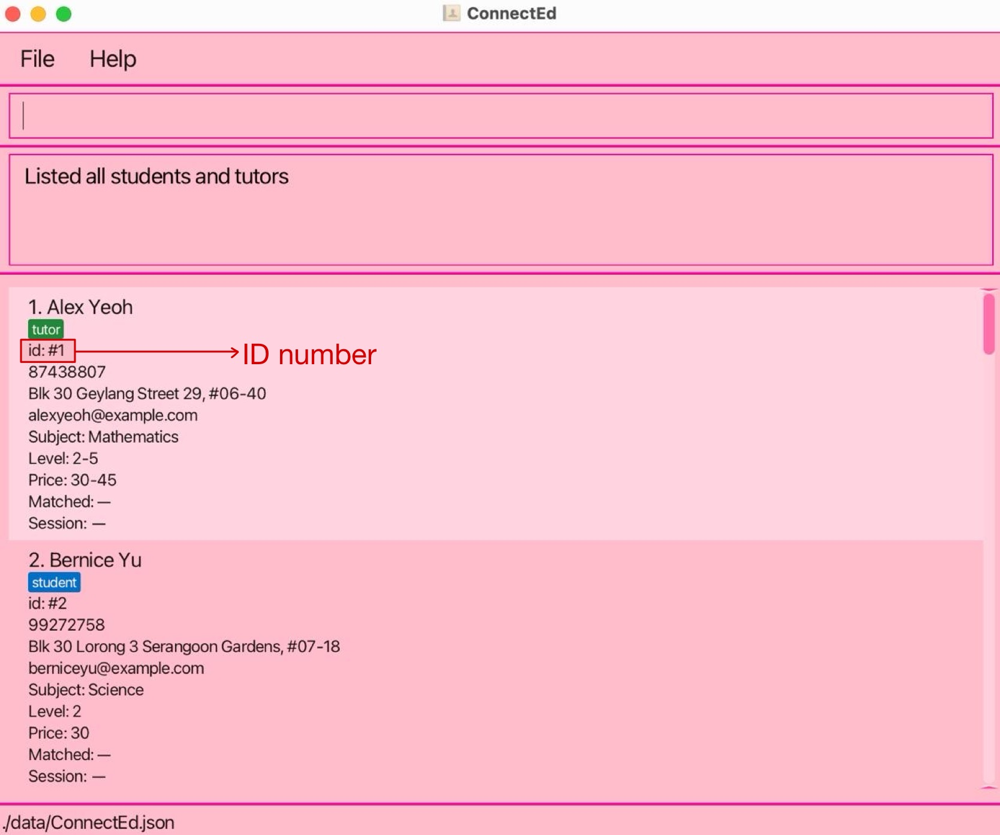
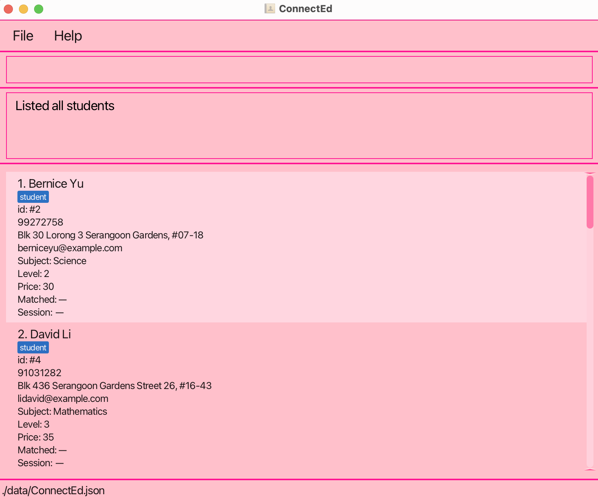
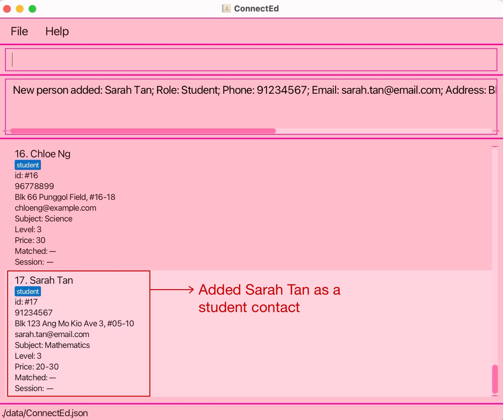
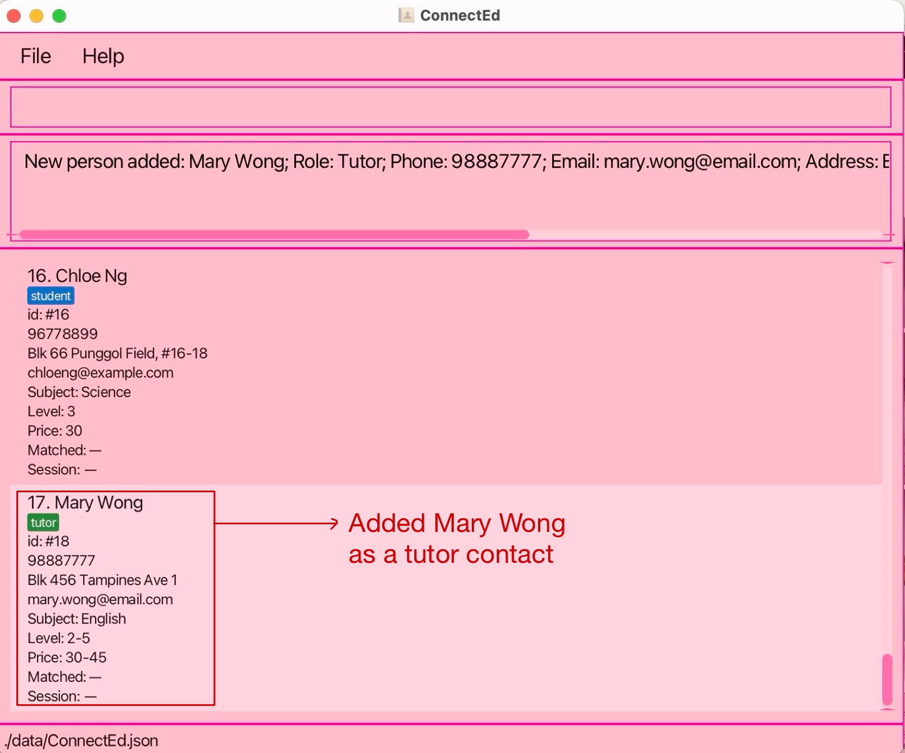
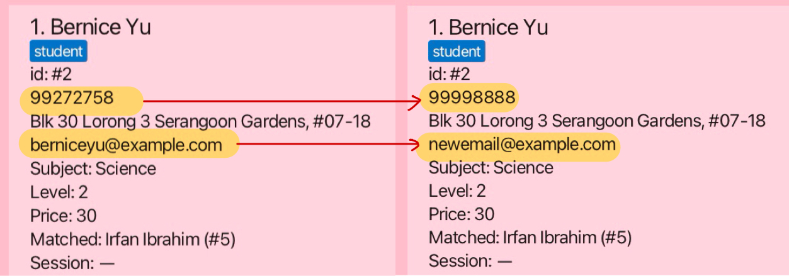
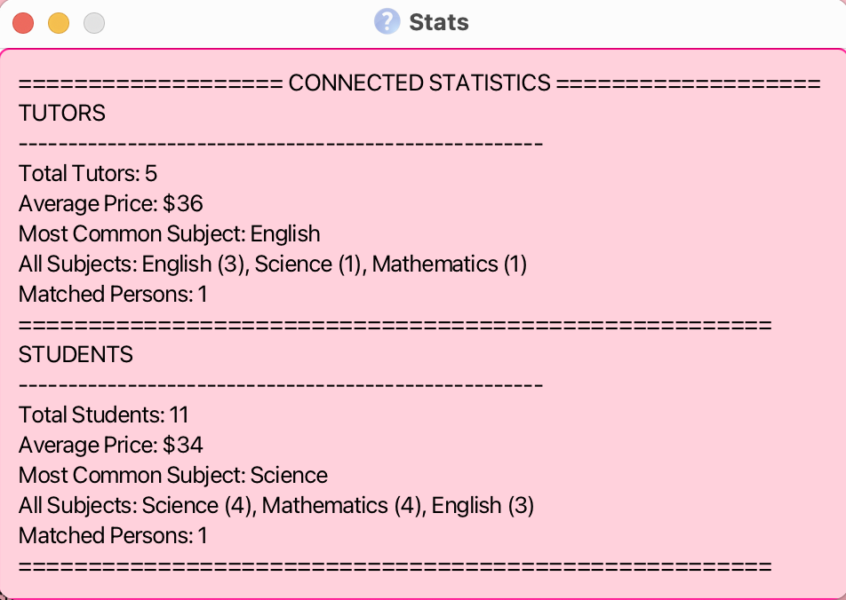

## 📘 **Welcome to ConnectEd!**
ConnectEd is a desktop application that helps you manage your primary school tutors and students efficiently. Instead of clicking through menus, you will type simple commands to get things done quickly. Think of it like using search on a website - you type what you want, press Enter, and get instant results. Once you learn a few basic commands, you will work much faster than with traditional software!

* Table of Contents
{:toc}

--------------------------------------------------------------------------------------------------------------------

## Getting Started: Installation
Before you can use ConnectEd, you need to install it on your computer. Follow these steps carefully.
### Step 1: Check if you have Java Installed
#### Windows Users
1. Click the Start button (Windows logo) at the bottom-left of your screen.
2. Type `cmd` and press Enter. A black window will appear - this is the Command Prompt.
3. In the black window, type exactly: `java -version`.
4. Press Enter.

#### Mac Users
1. Type command + space bar to activate Spotlight Search.
2. Search for `Terminal` and click on it. A black window should appear - this is the Terminal.
3. In the black window, type exactly: `java -version`.
4. Press Enter.
> ✅ **What to expect**
> <br>If you see: `java version "17.0"` or higher - Great! Java is installed. Skip to Step 2.
> 
> If you see: `java is not recognized` or an error - You need to install Java. Continue below.

#### Installing Java (if needed)
5. Click [here](https://www.oracle.com/java/technologies/downloads/)
6. Download Java 17 or higher for your operating system (Windows/Mac).
7. Run the downloaded file and follow the installation wizard.
8. Click "Next" until installation is complete.
9. Restart your computer after installation.
> 🍎 **Mac Users - Important!**
> <br>Mac Users must have the precise JDK version prescribed [here](https://se-education.org/guides/tutorials/javaInstallationMac.html).

### Step 2: Download ConnectEd
10. Download the latest `.jar` file from [here](https://github.com/AY2526S1-CS2103T-F08b-3/tp/releases).
11. Download the file named `ConnectEd.jar`.
12. Create a new folder on your computer called ConnectEd. 
13. Move the downloaded `ConnectEd.jar` file into this folder.
>💡 **Tip**
> <br>Create the ConnectEd folder in an easy-to-find location like your Desktop or Documents folder. You will be accessing it regularly!

### Step 3: Run ConnectEd for the First Time
Now, let's start the application:
14. Open Terminal/Command Prompt again. (Refer to Step 2 above)
15. Type `cd` followed by a space, then the location of your ConnectEd folder (e.g., `cd Desktop` or `cd Documents`)
16. Type `cd ConnectEd` to access ConnectEd.
17. Type exactly: `java -jar ConnectEd.jar`.
18. Press enter.
> ✅ **Success!**
> <br>A pink window like the one below should appear after a few seconds. This is ConnectEd!
   

--------------------------------------------------------------------------------------------------------------------

## Understanding the ConnectEd Window
Let's get familiar with what you see on the screen:
> 🖥️ **The ConnectEd Window Layout**
> <br>At the top: Menu bar with 'File' and 'Help' options
> 
> Pink command box: This is where you type your commands (at the very top)
> 
> Results area: Shows feedback after you run a command (below command box)
> 
> Main display area: Shows your list of tutors and students
> 
> Bottom: Shows the file location where your data is saved

### What Information You Will See for Each Person
Each tutor or student entry shows:
* **Name** - The person's full name
* **Role badge** - 'tutor' (green) or 'student' (blue)
* **ID number** - A unique number for that person (e.g., id: #1)
* **Phone number** - Contact number
* **Address** - Physical address
* **Email** - Email address
* **Subject** - What they teach/study (strictly only: Mathematics, English, Science)
* **Level** - Grade level (Level 1-6 means Primary 1 - Primary 6)
* **Price** - Hourly rate or price range (e.g., 20-30 means $20-$30 per hour)
* **Matched** - Shows who they're paired with (if anyone)
* **Session** - Shows scheduled lesson details (if any)

--------------------------------------------------------------------------------------------------------------------

## Basic Commands
Below are the most basic commands to get started with ConnectEd!

### Viewing All Contacts
Shows all your tutors and students.
```
list
```


> 💡 **What you'll see**
> <br>Everyone in your database will appear in the main display area.
> 
> Each person has a number next to their name - this is their ID number.

### Viewing Only Students or Only Tutors
Sometimes you want to see only students or only tutors:
**Show only students:**
```
list students
```


**Show only tutors:**
```
list tutors
```


### Getting Help
Shows a message explaining how to access the help page.
```
help
```


--------------------------------------------------------------------------------------------------------------------

## Common Tasks
Here are the tasks you'll do most often as a tuition coordinator. Each task includes the exact command you need to type.

### Adding a New Student
When a new student registers with your agency, you need to add them to ConnectEd.
<br> Students can only read one subject.

> 📝 **Information you'll need**
> * Whether they're a student or tutor 
> * Their full name 
> * Phone number (8 digits)
> * Email address 
> * Home address 
> * Subject they need help with (English, Mathematics, or Science)
> * Their current grade level (1-6)
> * Budget per hour (e.g., 20-30)

**Command Structure:**
```
add r/student n/<NAME> hp/<PHONE> e/<EMAIL> a/<ADDRESS> sbj/<SUBJECT> l/<LEVEL> p/<PRICE/ PRICE RANGE (MIN-MAX)>
```
**Real Example:**
<br>Let's say Sarah Tan registers. She's a Primary 3 student who needs help with Mathematics, budget $20-30/hour:
```
add r/student n/Sarah Tan hp/91234567 e/sarah.tan@email.com a/Blk 123 Ang Mo Kio Ave 3, #05-10 sbj/mathematics l/3 p/20-30
```


> ⚠️ **Important Rules**
> * Each piece of information needs its label (r/, n/, hp/, etc.)
> * Don't put spaces around the / symbol 
> * **hp/**: Phone numbers can only be 8 digits (Singapore phone numbers), only numbers are allowed (no spaces or special characters except between the 4th and 5th number)
>   * 1st digit must be 9/8/6
>   * 2nd digit if 1st digit is 9 must be from 0-8 only
> * **sbj/**: Subject must be: english, mathematics, or science (lowercase is fine)
> * **l/**: Level must be a single number from 1-6 for students 
> * **p/**: Price can either be a single integer OR two numbers (min - max) with a dash: 20-30 (no spaces, no $). Accepts values from 1-200.
> * Each student/tutor can only be entered once into the database! 

> 📢 **Duplicate Entries**
> <br> If 2 entries have the same:
> * Phone number
> OR
> * Email
> 
> They will be counted as the same person!

### Adding a New Tutor 
Adding a tutor is almost the same as adding a student, with one difference: **tutors can teach multiple grade levels**.
<br> Tutors can only teach one subject. 

**Command Structure:**
```
add r/tutor n/<NAME> hp/<PHONE> e/<EMAIL> a/<ADDRESS> sbj/<SUBJECT> l/<LEVEL/ LEVEL RANGE (MIN-MAX)> p/<PRICE/ PRICE RANGE( MIN-MAX)>
```
**Real Example:**
<br>Mary Wong is a tutor who teaches English for Primary 2-5 students, charges $30-45/hour:
```
add r/tutor n/Mary Wong hp/98887777 e/mary.wong@email.com a/Blk 456 Tampines Ave 1 sbj/english l/2-5 p/30-45
```


> 📌 **Tutor vs Student Differences**
> <br>**Students**: Level is a single number (l/3)
> 
> **Tutors**: Level can be a range (l/2-5) or single number (l/3)
> 
> This means Mary can teach students from Primary 2 to Primary 5.

### Finding Tutors or Students
When you need to find tutors who match a student's requirements, and vice versa, use the find command.
<br> Lists all people matching the criteria specifications.

**Command Structure:**
```
find [tutors/students] [n/ NAME] [s/ SUBJECT] [l/ LEVEL (single or range)] [p/ PRICE (single or range)]
```
**[] = optional fields**

#### Finding by Subject
**Find all Mathematics tutors:**
```
find tutors sbj/mathematics
```
UG.jpg)

#### Finding by Multiple Criteria
You can combine subject, level, and price to narrow down results:

**Find English tutors for Primary 5, budget $25-40:**
```
find tutors sbj/english l/5 p/25-40
```
UG.jpg)

> 🔍 **How the search works**
> <br>**Subject**: Must match exactly (mathematics, english, or science)
> 
> **Level**: Finds tutors/students whose level range includes what you specify
> 
> **Price**: Finds tutors whose price range **overlaps** with your budget / finds students whose price range **includes** the given value or range. 
> * Example: If a tutor teaches levels 2-5 and you search for level 3, that tutor will appear in the results!

### Getting Recommendations
ConnectEd can recommend suitable tutors for a student (or suitable students for a tutor) based on their requirements.

**Command Structure:**
```
recommend INDEX [sbj/] [l/] [p/]
```
**[] = optional fields**

**Recommend tutors for the student at `index` 1:**
```
recommend 1
```
This will show all tutors who:
* Teach the same subject 
* Can teach the student's grade level 
* Fit within the student's budget

UG.jpg)
UG.jpg)

**Filtering Recommendations:**
<br>You can also ask for recommendations based on just one or two criteria:

**Recommend based on subject only:**
```
recommend 1 sbj/
```
**Recommend based on subject and level:**
```
recommend 1 sbj/ l/
```
**Recommend based on price only:**
```
recommend 1 p/
```

### Matching Students and Tutors
Once you've found the perfect tutor for a student, you need to officially match them in the system.

**Command Structure:**
```
match <id 1> <id 2>
```
* IDs must correspond to one tutor and one student exactly

#### Steps to Match:
1. Use `list` to see all people.
2. Note the ID numbers of the student and tutor (the numbers shown as `id: #1`, `id: #2`, etc.)
3. Use the match command with both ID numbers

**Match student #2 with tutor #5:**
```
match 2 5
```
UG.jpg)
UG.jpg)

> ✨ **What happens when you match**
> * Both the student and tutor will show each other's name under "Matched:"
> * The order doesn't matter: match 2 5 and match 5 2 do the same thing 
> * A student can only be matched with one tutor at a time 
> * A tutor can only be matched with one student at a time

#### Unmatching:
If a tutoring arrangement ends, you can unmatch them:

**Command Structure:**
```
unmatch <id>
```
* ID can be either the student's or the tutor's ID

**Unmatch the person with ID #2 (and their partner):**
```
unmatch 2
```
UG.jpg)
UG.jpg)

> 💡 **Tip**
> <br>You only need ONE person's ID to unmatch. ConnectEd will automatically unmatch both the student and tutor in that pair.

### Scheduling a Tutoring Session
After matching a student and tutor, you'll want to schedule their weekly lesson.

> ⚠️ **Important**
> <br>A student and tutor must be matched BEFORE you can add a session!
> You cannot schedule a session for unmatched people.

#### Adding a Session
**Command structure:**
```
sessionadd <INDEX> d/<DAY> t/<TIME> dur/<DURATION> sbj/<SUBJECT> p/<PRICE>
```

**Real Example:**
Schedule a Monday session at 4:00 PM, 2 hours long, Mathematics, $30/hour for the person with ID #1:
```
sessionadd 1 d/Monday t/16:00 dur/02:00 sbj/mathematics p/30
```
UG.jpg)
UG.jpg)

> 📋 **Session Details Explained**
> * d/ - Day of the week (Monday, Tuesday, Wednesday, etc.)
> * t/ - Start time in 24-hour format (16:00 = 4:00 PM)
> * dur/ - Duration in hours and minutes (02:00 = 2 hours)
> * sbj/ - Subject (must match the matched pair's subject)
> * p/ - Price per hour (as a single integer, e.g., 30 for $30/hour)
>   * Price in the session must be within the range of both the matched students/tutors
>   * E.g., Student (20-30) <-> Tutor (10-20), session price can only be 20.

#### Deleting a Session
If you need to cancel or remove a scheduled session:

**Command Structure:**
```
sessiondelete <INDEX>
```

**Delete the session for person #1:**
```
sessiondelete 1
```
UG.jpg)
UG.jpg)

> 💡 **Note**
> <br>When you add a session to one person, it automatically appears for their matched partner too. Similarly, deleting a session removes it for both people.

### Editing Someone's Information
When a tutor or student's details change (new phone number, moved house, changed rates), you can update their information.

> ⚠️ **Important**
> <br>A student's level cannot be edited to have a range.
> Only possible for tutors to have a range of levels.

**Command structure:**
```
edit <INDEX> [fields to update]
```

**Real Examples:**
Update phone number and email for person #1:
```
edit 1 hp/99998888 e/newemail@example.com
```


Update price range for person #3:
```
edit 3 p/35-50
```
Update subject and level for tutor #2:
```
edit 2 sbj/science l/4-6
```

> ✏️ **What you can edit**
> * n/ - Name 
> * hp/ - Phone number 
> * e/ - Email 
> * a/ - Address 
> * sbj/ - Subject 
> * l/ - Level 
> * p/ - Price range
>
> You can update one field or multiple fields at once.
> <br>You don't need to include fields you're not changing.

### Deleting a Person
When someone leaves your agency, you can remove them from the system.

**Command Structure:**
```
delete <INDEX>
```

**Delete person at index 3:**
```
delete 3
```

> ⚠️ **Warning: Be Careful!**
> * Deleting cannot be undone!
> * Always double-check the ID number before deleting
> * If the person is matched with someone, they will be automatically unmatched
> * Their session information will also be deleted

### Sorting Your Lists
You can organize your tutor or student lists by price or level to find what you need more easily.

**Command Structure:**
```
sort <tutors/students> <CRITERIA (see below)> OR sort reset
```
**criteria**
* p/ (sort by price only)
* l/ (sort by level only)
* p/ l/ (sort by price, then level)
* l/ p/ (sort by level, then price)
* sort reset (reset to full list)

**Sort tutors by price (lowest to highest):**
```
sort tutors p/
```
UG.jpg)

**Sort students by level (lowest to highest):**
```
sort students l/
```
**Sort tutors by price, then by level:**
```
sort tutors p/ l/
```
**Reset sorting and show everyone:**
```
sort reset
```
UG.png)

> 📊 **How sorting works**
> * Sorts in ascending order
> * For level ranges like 2-5, sorting uses the lower number (2)
> * Sorting filters the list to show only tutors OR only students
> * If an existing filter is already present, the sort command will further sort the list with the current filters.
> * Use `sort reset` to go back to seeing everyone

### Viewing Statistics
Want to see an overview of your agency's data? Use the stats command!
**Show statistics:**
```
stats
```
The statistics window will show you:
* Total number of tutors and students
* Average price for tutors and students
* Most popular subjects
* Subject distribution (how many people for each subject)
* Number of matched pairs



> 📝**Note**
> <br> Remember to close the `stats` window and use the `stats` command again in order to see the latest updated data.

--------------------------------------------------------------------------------------------------------------------

## Complete Command Reference

This section lists every command in ConnectEd with examples. Use this as a quick reference guide.

### Viewing & Navigation Commands

| Command | What it does | Example |
|---------|-------------|---------|
| `list` | Show everyone | `list` |
| `list students` | Show only students | `list students` |
| `list tutors` | Show only tutors | `list tutors` |
| `help` | Open help window | `help` |
| `stats` | Show statistics | `stats` |

### Adding & Editing Commands

| Command | Example                                                                                       |
|---------|-----------------------------------------------------------------------------------------------|
| **Add student** | `add r/student n/John hp/91234567 e/john@email.com a/123 Main St sbj/mathematics l/3 p/20-30` |
| **Add tutor** | `add r/tutor n/Mary hp/98765432 e/mary@email.com a/456 Side Ave sbj/english l/2-5 p/30-45`    |
| **Edit person** | `edit 1 hp/99998888 e/newemail@example.com`                                                   |
| **Delete person** | `delete 3`                                                                                    |

### Searching & Filtering Commands

| Command | Example                                     |
|---------|---------------------------------------------|
| **Find by subject** | `find tutors sbj/mathematics`               |
| **Find by multiple criteria** | `find tutors sbj/mathematics l/3-4 p/20-35` |
| **Find by name** | `find students n/John`                      |
| **Recommend matches** | `recommend 1`                               |
| **Recommend by subject only** | `recommend 1 sbj/`                          |

### Matching & Session Commands

| Command | Example                                                        |
|---------|----------------------------------------------------------------|
| **Match student & tutor** | `match 1 2`                                                    |
| **Unmatch** | `unmatch 1`                                                    |
| **Add session** | `sessionadd 1 d/Monday t/16:00 dur/02:00 sbj/mathematics p/30` |
| **Delete session** | `sessiondelete 1`                                              |

### Sorting & Organization Commands

| Command | Example |
|---------|---------|
| **Sort by price** | `sort tutors p/` |
| **Sort by level** | `sort students l/` |
| **Sort by multiple criteria** | `sort tutors p/ l/` |
| **Reset sorting** | `sort reset` |

### System Commands

| Command | What it does | Example |
|---------|-------------|---------|
| `clear` | Delete ALL data (be very careful!) | `clear` |
| `exit` | Close the program | `exit` |

--------------------------------------------------------------------------------------------------------------------

## Troubleshooting: Common Problems & Solutions

Don't panic if something goes wrong! Here are solutions to the most common problems you might encounter.

### Installation Problems

❌ **'Java is not recognized'**
> **Problem:** Java is not installed or not in your system PATH
>
> **Solution:**
> 1. Install Java 17 or higher from Oracle's website
> 2. Restart your computer after installation
> 3. Try running ConnectEd again

### Command Errors

❌ **'Invalid command format'**
> **Problem:** The command structure is wrong
>
> **Common mistakes:**
> * Forgot to include the label (like `r/`, `n/`, `hp/`)
> * Spelled the command name wrong
>
> **Solution:** Check the Command Reference section and copy the exact format

❌ **'Subject must be english, mathematics, or science'**
> **Problem:** Subject name is misspelled or not recognized
>
> **Solution:**
> - Only three subjects are allowed: `english`, `mathematics`, `science`
> - Spelling must be exact (though case doesn't matter)
> - Can't abbreviate (not 'math' or 'maths')
> - Examples: `sbj/mathematics` ✓  `sbj/english` ✓  `sbj/science` ✓

❌ **'Level must be between 1-6'**
> **Problem:** Level number is outside the valid range
>
> **Solution:**
> - For students: Use a single number from 1-6 (e.g., `l/3`)
> - For tutors: Use a single number (`l/4`) or range (`l/2-5`)
> - Range format: no spaces around the dash (`l/2-5` ✓ not `l/2 - 5` ✗)
> - Can't use 0 or numbers above 6

❌ **'Price range invalid'**
> **Problem:** Price format is incorrect
>
> **Solution:**
> - Format must be: `min-max` (e.g., `p/20-30`)
> - Both numbers must be between 1-200
> - First number must be less than or equal to second number
> - No spaces around the dash
> - Don't include $ symbol
> - Example: `p/20-30` ✓  Wrong: `p/$20-$30` ✗ or `p/30-20` ✗

### Matching & Session Errors

❌ **'Person not found'**
> **Problem:** The ID number you entered doesn't exist
>
> **Solution:**
> 1. Type `list` to see all people and their ID numbers
> 2. Check that you're using the ID number, not the position in the list
> 3. Make sure you typed the number correctly

❌ **'Cannot match - incompatible subject/level/price'**
> **Problem:** The student and tutor don't meet the matching requirements
>
> **Solution:**
> Check that:
> - They have the same subject
> - The tutor's level range includes the student's level
> - Their price ranges overlap
>
> **Example that works:**
> - Student: Mathematics, Level 3, $20-30
> - Tutor: Mathematics, Level 2-5, $25-40
> - (Level 3 is in range 2-5, and prices $25-30 overlap)

❌ **'Person must be matched before adding session'**
> **Problem:** You're trying to schedule a session for someone who isn't matched
>
> **Solution:**
> 1. First match the student and tutor using: `match [ID1] [ID2]`
> 2. Then add the session
>
> You cannot add sessions for unmatched people!

❌ **'Session subject must match person's subject'**
> **Problem:** You're trying to schedule a session for a different subject
>
> **Solution:**
> - The session subject must match what the matched pair teaches/studies
> - Check the person's profile to see their subject
> - Example: If they're matched for Mathematics, you can't add an English session

### Data & Display Issues

❌ **The list is empty / I can't see my contacts**
> **Problem:** You might have accidentally filtered or deleted data
>
> **Solution:**
> 1. Type `sort reset` to clear any filters
> 2. Type `list` to show everyone


❌ **'This person already exists'**
> **Problem:** Someone with identical details is already in the system
>
> **Solution:**
> - You cannot have two people with the exact same name, phone, email, and address
> - If this is genuinely a different person, change at least one detail
> - If you're trying to update existing info, use `edit` instead of `add`

--------------------------------------------------------------------------------------------------------------------

## Data Management & Backups

Your tutor and student data is precious! Here's how ConnectEd saves your data and how to protect it.

### How ConnectEd Saves Your Data

**Good news:** ConnectEd automatically saves your data after every change! You never need to click a "Save" button.

> 💾 **Automatic Saving**
>
> Every time you:
> - Add a new person
> - Edit someone's details
> - Match or unmatch people
> - Add or delete a session
> - Delete a person
>
> ConnectEd immediately saves the change to your hard drive.

### Where Your Data is Stored

Your data is saved in a file called `ConnectEd.json` located in:

```
[Your ConnectEd folder]/data/ConnectEd.json
```

> 📁 **Finding your data file**
>
> 1. Go to the folder where you put `connected.jar`
> 2. Look for a folder called `data`
> 3. Inside, you'll find `ConnectEd.json` - this is your database!
>
> The location is also shown at the bottom of the ConnectEd window.

--------------------------------------------------------------------------------------------------------------------

## Frequently Asked Questions
### General Questions

**Q: Why does ConnectEd use commands instead of buttons?**

A: Commands are much faster once you learn them! Instead of clicking through multiple menus (File → New → Student → Fill form → Save), you just type one line and press Enter. It might seem strange at first, but you'll be working 3-4 times faster within a week.

**Q: Can I use ConnectEd on Mac, Windows, and Linux?**

A: Yes! ConnectEd works on all three operating systems as long as you have Java 17 or higher installed. The commands work exactly the same on all platforms.

**Q: Can multiple people use ConnectEd at the same time?**

A: No, ConnectEd is designed for single-user access. If multiple coordinators try to access the same data file simultaneously, data corruption may occur. For multi-user access, each coordinator should have their own copy of ConnectEd with separate data files.

**Q: Is my data secure?**

A: Your data is stored locally on your computer in the `ConnectEd.json` file. It is as secure as your computer.

### Feature Questions
**Q: Can a tutor be matched with multiple students?**

A: No, currently ConnectEd only supports one-to-one matching. Each tutor can be matched with one student at a time, and vice versa. If a tutor teaches multiple students, you would need to add the tutor multiple times (with slight variations in details) or track additional students outside ConnectEd.

**Q: Why are only three subjects available?**

A: ConnectEd currently supports English, Mathematics, and Science as these are the most common primary school subjects. If you need additional subjects, contact your software provider about customization options or updates.

**Q: Can I add multiple sessions per matched pair?**

A: Currently, ConnectEd supports one session per matched pair. If you add a new session, it will replace the existing one. For multiple weekly sessions, you might track them outside ConnectEd or add notes to the session details.

--------------------------------------------------------------------------------------------------------------------

## Known issues

1. **When using multiple screens**, if you move the application to a secondary screen, and later switch to using only the primary screen, the GUI will open off-screen. The remedy is to delete the `preferences.json` file created by the application before running the application again.
2. **If you minimize the Help Window** and then run the `help` command (or use the `Help` menu, or the keyboard shortcut `F1`) again, the original Help Window will remain minimized, and no new Help Window will appear. The remedy is to manually restore the minimized Help Window.

--------------------------------------------------------------------------------------------------------------------
