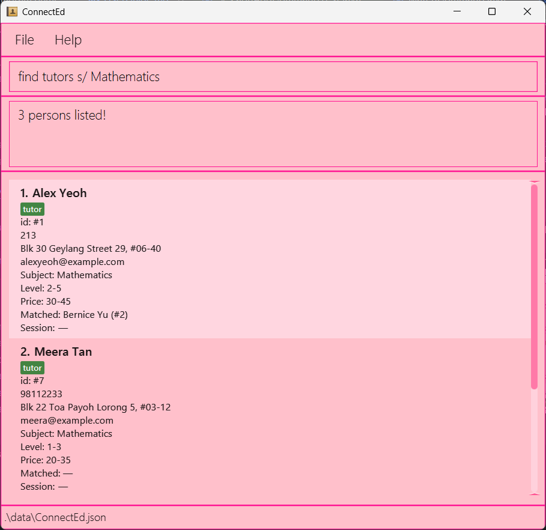

ConnectEd is a **desktop app for managing tutors and students, optimized for use via a Command Line Interface** (CLI) while still having the benefits of a Graphical User Interface (GUI). If you can type fast, ConnectEd can get your contact management tasks done faster than traditional GUI apps.

* Table of Contents
{:toc}

--------------------------------------------------------------------------------------------------------------------

## Quick start

1. Ensure you have Java `17` or above installed in your Computer. 
   **Mac users:** Ensure you have the precise JDK version prescribed [here](https://se-education.org/guides/tutorials/javaInstallationMac.html).

2. Download the latest `.jar` file from [here](https://github.com/se-edu/addressbook-level3/releases).

3. Copy the file to the folder you want to use as the _home folder_ for your AddressBook.

4. Open a command terminal, `cd` into the folder you put the jar file in, and use the `java -jar connected.jar` command to run the application. 
   A GUI similar to the below should appear in a few seconds. Note how the app contains some sample data. 
   

5. Type the command in the command box and press Enter to execute it. e.g. typing **`help`** and pressing Enter will open the help window. 
   Some example commands you can try:

    * `list tutors` : Lists all tutors (use `list students` to list all students).

   * `add r/student aaron hp/91234567 a/Blk 30 Geylang Street 29, #06-40 s/mathematics l/3 p/20-30` : Adds a **student** with subject, level, and price range.
     (Example for tutor: `add r/tutor Mary hp/98765432 a/Tampines Ave 1 s/english l/2-5 p/25-40`)

   * `delete 1` : Deletes the 1st **person** shown in the current list.

   * `clear` : Deletes all entries.

   * `exit` : Exits the app.

6. Refer to the [Features](#features) below for details of each command.

--------------------------------------------------------------------------------------------------------------------

## Features

**:information_source: Notes about the command format:** 

* Parameters & placeholders
  Commands follow the below exactly:
  * Add: `add r/<tutor/student> n/<name> hp/<phone> a/<address> s/<subject> l/<level> p/<min-max>`
  * List: `list <tutors/students>`
  * Find: `find <tutors/students> <field>/ <filter_value>` where `<field>` is `s/`, `l/`, or `p/`
  * Match: `match <ID_1> <ID_2>`
  * Unmatch: `unmatch <ID_1>` or `unmatch <ID_2>` 

* Accepted values (validators)  
  * `<tutor/student>` for `add`: exactly “tutor” or “student” (case-insensitive).  
  * `<tutors/students>` for `list` and `find`: exactly “tutors” or “students” (case-insensitive).  
  * `hp/` phone: 8 digits (spaces allowed), digits only.  
  * `s/` subject: one of {english, mathematics, chinese, science} (case-insensitive).  
  * `l/` level:  
    * Student: single integer 1–6  
    * Tutor: single integer 1–6 **or** range `x-y` (1–6 to 1–6; no internal spaces)  
  * `p/` price range: `min-max`, integers 1–200.  

* Typed indices
  * Use `<INDEX>` persons (1-indexed; visible list indices; no spaces).
  * Examples: `delete 1`, `delete 2`, `match 1 2`, `unmatch 2`.

* Errors (shape & value)
   The app guides with specific messages on: wrong command format, missing/invalid `<tutor/student>` or `<tutors/students>`, invalid field (`/s` `/l` `/p`), malformed values (non-integer level, bad `min-max`, min>max), duplicates, and empty lists.

* Extraneous parameters for commands that do not take in parameters (such as `help`, `exit`, `clear` and `stats`) will be ignored. 
  e.g. if the command specifies `help 123`, it will be interpreted as `help`.

* If you are using a PDF version of this document, be careful when copying and pasting commands that span multiple lines as space characters surrounding line-breaks may be omitted when copied over to the application.

### Viewing help : `help`

Shows a message explaining how to access the help page.

Format: `help`

### Adding a tutor or student: `add`

Adds a **tutor** or **student** with subject, level, and price range.

Format: `add r/<tutor/student> n/<name> hp/<phone> a/<address> s/<subject> l/<level> p/<min-max>`

Examples:
* `add r/student n/aaron hp/91234567 a/Blk 30 Geylang Street 29, #06-40 s/mathematics l/3 p/20-30`
* `add r/tutor n/Mary hp/98765432 a/Tampines Ave 1 s/english l/2-5 p/25-40`

### Listing all persons : `list`

Shows a list of either tutors or students.

Format: `list tutors`  |  `list students`

Examples: `list tutors` , `list students`

### Finding *tutors* or *students*: `find`

Returns a filtered list of students/tutors from our database based on one condition (subject, level, or price).

Returns a filtered list of students or tutors from the database based on one or more conditions such as name, subject, level, or price.

Format: find <tutors/students> <field>/ <filter_value> [<field>/ <filter_value> ...]

Description:
- <tutor/student> specifies whether to search tutors or students. 
  This field is optional — omitting it searches all persons.
- <field>/ must be one of the following prefixes:
  - n/  for name
  - s/  for subject
  - l/  for level
  - p/  for price range
- <filter_value> is the keyword, number, or range to match for the field.
- Prefix order does not matter.
- Multiple prefixes of the same type are allowed (e.g. s/ math s/ science).
- All conditions are combined with logical AND, meaning all must match.

Parameter Specifications:
- <tutor/student> must be exactly tutor or student (case-insensitive).
- <field>/ must be one of the following:
    - n/  for name
    - s/  for subject
    - l/  for level (1–6)
    - p/  for price range
- <filter_value> must match the expected field type:
    - n/ <name>: keyword from the person's name (e.g. Aaron, Tan)
    - s/ <subject>: subject keyword (e.g. mathematics, english, science)
    - l/ <level>: single integer from 1–6 or a range like 2–4
    - p/ <range>: one or two integers separated by a dash (e.g. 10–20, 30)

Examples:
- find tutors n/ Aaron — finds all tutors with “Aaron” in their name.
- find tutors s/ Mathematics — finds all tutors teaching Mathematics.
- find tutors l/ 3 — finds all tutors teaching Level 3 students.
- find students p/ 10–20 — finds all students offering a price range of $10–20/hour.
- find tutors s/ Mathematics l/ 2–4 p/ 25–50 — finds tutors teaching Math for Levels 2–4, charging $25–50/hour.
- find students s/ English s/ Chinese p/ 15 — finds students needing English or Chinese at $15/hour.

Notes:
- You can combine multiple filters in one command.
- Prefixes can appear in any order.
- The same prefix can appear multiple times with different values.
- Invalid formats (e.g. p/ abc, l/ 10–5) will show an “Invalid command format” error.
  

### Match/Unmatch a student and a tutor : `match/unmatch`

Link one Tutor and one Student so both are flagged as Matched and hold a bidirectional reference to each other.
Supports undoing via unmatch.

Format:
* Match: `match <ID of Person 1> <ID of Person 2> (Order of student teacher does not matter)`
* Unmatch: `unmatch <ID of Person> (Only require index of one of the matched pair)`
* Matches the student and tutor at the specified `ID`.
* Unmatch the student/tutor at the specified `ID` and its corresponding matched tutor/student.
* The id refers to the unique id number associated with each student and tutor.
* The id **must be a positive integer** 1, 2, 3, …​

Examples:
* `match 1 2` For a tutor with Id 1 and student with Id 2, matches the tutor with the student in the list.
* `unmatch 1` For a tutor with Id 1, unmatch the tutor with its corresponding matched student.
  

### Recommending persons : `recommend`
Recommends a list of tutors to a student or a list of students to a tutor based on subject, level, and/or price range.

Format: `recommend INDEX [s/] [l/] [p/]`
* Recommends tutors to a student or students to a tutor at the specified `INDEX`.
* The index refers to the index number shown in the current displayed list.
* The index **must be a positive integer** 1, 2, 3, …​
* Optional fields can be specified to filter the recommendations based on subject (`s/`), level (`l/`), and/or price range (`p/`).
* If no optional fields are specified, recommendations will be based on all three criteria (subject, level, and price range).

Examples:
* `recommend 1` recommends all tutors/students that matches the subject, level, and price range of person at index 1
* `recommend 2 s/` recommends all tutors/students that matches the subject of person at index 2
  

### Sorting student/tutor list : `sort`
Sorts the displayed list of students or tutors based on specified field(s) in ascending order.

Format: `sort <tutors/students> <criteria>/`
* `<tutors/students>`: specifies whether to sort the tutor or the student list.
* `<criteria>`: must be one of the following keywords:
  * `p/`: price range
  * `l/`: level
* Criteria is applied in the order specified. For example, `p/ l/` sorts by price first, then by level for entries with the same price

Examples:
* `sort tutors p/`: sorts all tutors by price only
* `sort students l/`: sorts all students by level only
* `sort tutors p/ l/`: sorts all tutors by price, then level
* `sort students l/ p/`: sorts all students by level, then price
  

Notes:
* The sort command filters the list to show only tutors or students (based on your selection) before sorting
* For price ranges (e.g., `10-20`), sorting uses the lower bound value (`10`)
* For level ranges (e.g., `3-5`), sorting uses the lower bound value (`3`)

### Deleting a person : `delete`

Deletes a person (student/tutor) from the ConnectEd database

Format:
* Delete person: `delete <INDEX>`
* Deletes the person at the specified `INDEX`.
* The index refers to the index number shown in the displayed tutor/student list.
* The index **must be a positive integer** 1, 2, 3, …​

Examples:
* `delete 1` deletes the 1st person in the displayed list.

### Clearing all entries : `clear`

Clears all entries from the ConnectEd.

Format: `clear`

### Viewing statistics : `stats`
Displays statistics about the current tutors and students in ConnectEd, including total counts, average prices, subject distributions, and matched pairs.

Format: `stats`

### Exiting the program : `exit`

Exits the program.

Format: `exit`

### Saving the data

ConnectEd data are saved in the hard disk automatically after any command that changes the data. There is no need to save manually.

### Editing the data file

ConnectEd data are saved automatically as a JSON file `[JAR file location]/data/addressbook.json`. Advanced users are welcome to update data directly by editing that data file.

:exclamation: **Caution:**
If your changes to the data file makes its format invalid, ConnectEd will discard all data and start with an empty data file at the next run. Hence, it is recommended to take a backup of the file before editing it. 
Furthermore, certain edits can cause the ConnectEd to behave in unexpected ways (e.g., if a value entered is outside of the acceptable range). Therefore, edit the data file only if you are confident that you can update it correctly.

### Archiving data files `[coming in v2.0]`

_Details coming soon ..._

--------------------------------------------------------------------------------------------------------------------

## FAQ

**Q**: How do I transfer my data to another Computer? 
**A**: Install the app in the other computer and overwrite the empty data file it creates with the file that contains the data of your previous AddressBook home folder.

--------------------------------------------------------------------------------------------------------------------

## Known issues

1. **When using multiple screens**, if you move the application to a secondary screen, and later switch to using only the primary screen, the GUI will open off-screen. The remedy is to delete the `preferences.json` file created by the application before running the application again.
2. **If you minimize the Help Window** and then run the `help` command (or use the `Help` menu, or the keyboard shortcut `F1`) again, the original Help Window will remain minimized, and no new Help Window will appear. The remedy is to manually restore the minimized Help Window.

--------------------------------------------------------------------------------------------------------------------

## Command summary

Action | Format, Examples
--------|------------------
**Add** |`add r/<tutor/student> <name> hp/ <phone> a/ <address> s/ <subject> l/ <level_or_range> p/ <min-max>` e.g., `add student aaron hp/ 91234567 a/ Blk 30 Geylang Street 29, #06-40 s/ mathematics l/ 3 p/ 20-30`
**Clear** | `clear`
**Delete** | `delete INDEX`  e.g., `delete 3`
**Find** | `find <tutors/students> <field>/ <filter_value>`  e.g., `find students s/ chinese`
**Match/Unmatch** | `match <Id> <Id> / unmatch <Id> `  e.g., `match 1 2 / unmatch 1`
**List** | `list students / list tutors`
**Sort** | `sort <students/tutors> <filter_criteria>`  e.g., `sort students p/`
**Recommend** | `recommend INDEX [s/] [l/] [p/]`  e.g., `recommend 1 s/ l/`
**Stats** | `stats`
**Help** | `help`
