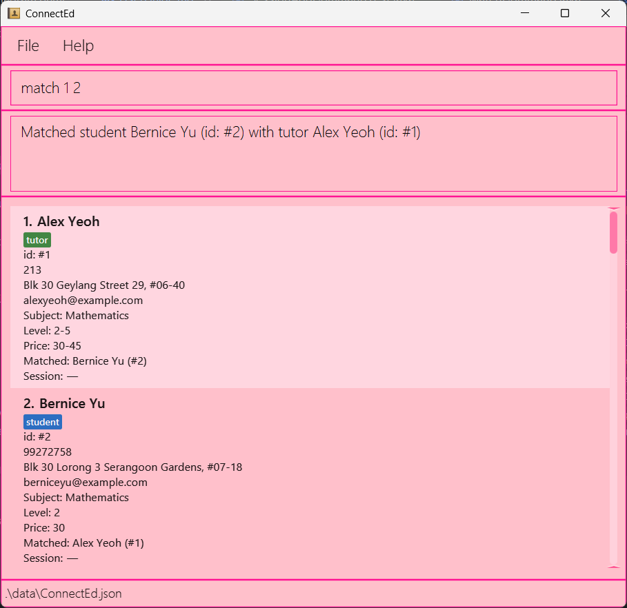
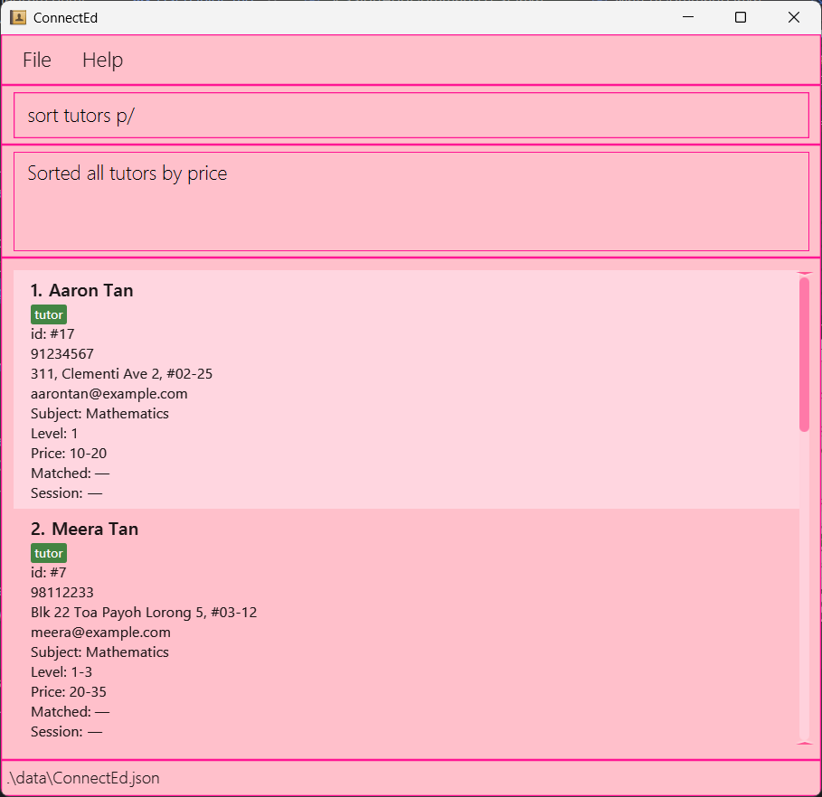

ConnectEd is a **desktop app for managing tutors and students, optimized for use via a Command Line Interface** (CLI) while still having the benefits of a Graphical User Interface (GUI). If you can type fast, ConnectEd can get your contact management tasks done faster than traditional GUI apps.

* Table of Contents
{:toc}

--------------------------------------------------------------------------------------------------------------------

## Quick start

1. Ensure you have Java `17` or above installed in your Computer. 
   **Mac users:** Ensure you have the precise JDK version prescribed [here](https://se-education.org/guides/tutorials/javaInstallationMac.html).

2. Download the latest `.jar` file from [here](https://github.com/se-edu/addressbook-level3/releases).

3. Copy the file to the folder you want to use as the _home folder_ for your AddressBook.

4. Open a command terminal, `cd` into the folder you put the jar file in, and use the `java -jar connected.jar` command to run the application. 
   A GUI similar to the below should appear in a few seconds. Note how the app contains some sample data. 
   

5. Type the command in the command box and press Enter to execute it. e.g. typing **`help`** and pressing Enter will open the help window. 
   Some example commands you can try:

    * `list` : Lists all tutors and students (use `list students` to list all students and `list tutors` to list all tutors).

   * `add r/student aaron hp/91234567 e/aaront@example.com a/Blk 30 Geylang Street 29, #06-40 s/mathematics l/3 p/20-30` : Adds a **student** with subject, level, and price range.
     (Example for tutor: `add r/tutor n/Mary hp/98765432 e/maryy@example.com a/Tampines Ave 1 s/english l/2-5 p/25-40`)

   * `delete 1` : Deletes the 1st **person** shown in the current list.

   * `clear` : Deletes all entries.

   * `exit` : Exits the app.

6. Refer to the [Features](#features) below for details of each command.

--------------------------------------------------------------------------------------------------------------------

## Features

**:information_source: Notes about the command format:** 

* Parameters & placeholders
  Commands follow the below exactly:
  * Add: `add r/<tutor/student> n/<name> hp/<phone> e/<email> a/<address> s/<subject> l/<level> p/<min-max>`
  * List: `list` or `list <tutors/students>`
  * Find: `find <tutors/students> <field>/ <filter_value>` where `<field>` is `s/`, `l/`, or `p/`
  * Match: `match <ID_1> <ID_2>`
  * Unmatch: `unmatch <ID_1>` or `unmatch <ID_2>`
  * Sort: `sort <tutors/students> <criteria>/` or `sort reset` where `<criteria>` is `p/` or `l/`

* Accepted values (validators)
  * `<tutor/student>` for `add`: exactly “tutor” or “student” (case-insensitive).
  * `<tutors/students>` for `list` and `find`: exactly “tutors” or “students” (case-insensitive).
  * `hp/` phone: 8 digits (spaces allowed), digits only.
  * `e/` email: has format local-part@domain
  * `s/` subject: one of {english, mathematics, science} (case-insensitive).
  * `l/` level:
    * Student: single integer 1–6
    * Tutor: single integer 1–6 **or** range `x-y` (1–6 to 1–6; no internal spaces)
  * `p/` price range: `min-max`, integers 1–200.

* Typed indices
  * Use `<INDEX>` persons (1-indexed; visible list indices; no spaces).
  * Examples: `delete 1`, `delete 2`, `match 1 2`, `unmatch 2`.

* Errors (shape & value)
   The app guides with specific messages on: wrong command format, missing/invalid `<tutor/student>` or `<tutors/students>`, invalid field (`/s` `/l` `/p`), malformed values (non-integer level, bad `min-max`, min>max), duplicates, and empty lists.

* Extraneous parameters for commands that do not take in parameters (such as `help`, `exit`, `clear` and `stats`) will be ignored. 
  e.g. if the command specifies `help 123`, it will be interpreted as `help`.

* If you are using a PDF version of this document, be careful when copying and pasting commands that span multiple lines as space characters surrounding line-breaks may be omitted when copied over to the application.

### Viewing help : `help`

Shows a message explaining how to access the help page.

Format: `help`

### Adding a tutor or student: `add`

Adds a **tutor** or **student** with subject, level, and price range.

Format: `add r/<tutor/student> n/<name> hp/<phone> e/<email> a/<address> s/<subject> l/<level> p/<min-max>`

Examples:
* `add r/student n/aaron hp/91234567 e/aaront@example.com a/Blk 30 Geylang Street 29, #06-40 s/mathematics l/3 p/20-30`
* `add r/tutor n/Mary hp/98765432 e/maryy@example.com a/Tampines Ave 1 s/english l/2-5 p/25-40`

### Editing a tutor or student: `edit`

Edits the details of an existing tutor or student in the ConnectEd database.

Format: `edit <INDEX> [n/<name>] [hp/<phone>] [e/<email>] [a/<address>] [s/<subject>] [l/<level>] [p/<min-max>] [t/tag]`

Examples:
* `edit 1 n/John Doe hp/91234567 e/johndoe`
* `edit 2 s/mathematics l/3 p/20-30`

### Listing all persons : `list`

Shows a list of either tutors or students.

Format: `list`  |  `list tutors`  |  `list students`

Examples: `list`, `list tutors` , `list students`

### Finding *tutors* or *students*: `find`

Returns a filtered list of tutors or students from the database based on one or more conditions such as name, subject, level, or price.

Format: `find <tutors/students> <prefix/ filter_value> [prefix/ <filter_value> ...]`

Description:
- `<tutors/students>` specifies whether to search tutors or students. 
- `<field>prefix` must be at least one of the following prefixes:
  - `n/` for name
  - `s/` for subject
  - `l/` for level
  - `p/` for price
- `<filter_value>` is the keyword, number, or range to match for the field.
- Prefix order does not matter.

Parameter Specifications:
- `<tutors/students>` must be exactly tutors or students. This field is optional.
- `prefix` must be at least one of the following:
  - `n/` for name
  - `s/` for subject
  - `l/` for level (single integer 1–6 or range like 2–4)
  - `p/` for price (single integer or range between 1–200)
- `<filter_value>` must match the expected field type:
  - n/ `<name>`: keyword from the person's name (e.g. Aaron, Tan)
    - `find tutors n/ Aaron Tan` finds all tutors with “Aaron” or “Tan” in their name.
  - s/ `<subject>`: subject keyword (e.g. Mathematics, English, Science)
    - `find tutors s/ Mathematics Science` finds all tutors who teach Mathematics or Science.
  - l/ `<level>`: single integer or range
    - `find students l/ 3-4` finds all students in Level 3 to 4.
    - `find tutors l/ 5-6` finds all tutors teaching Levels 5–6.
  - p/ `<price>`: single integer or range
    - `find students p/ 20` finds all students whose price **equals** \$20/hour.
    - `find students p/ 10-20` finds all students whose price **falls within** the \$10–\$20/hour range.
    - `find tutors p/ 20` finds all tutors whose **price or price range includes** \$20/hour.
    - `find tutors p/ 20-30` finds all tutors whose **price or price range overlaps** the \$20–\$30/hour range.

Logic behavior:
- When multiple values are given for the **same prefix**, the search uses **OR** logic.
  - Example: `find tutors s/ Mathematics Science` or  
    `find tutors s/ Mathematics s/ Science` returns tutors teaching **Mathematics OR Science**.
- When different prefixes are combined, the search uses **AND** logic.
  - Example: `find tutors s/ Mathematics l/ 4` returns tutors teaching **Mathematics AND Level 4**.

Examples:
- `find tutors s/ Mathematics l/ 2–4 p/ 25–50` — finds tutors teaching Math for Levels 2–4, charging \$25–50/hour.
- `find students s/ English s/ Chinese p/ 15` — finds students needing English or Chinese at \$15/hour.

  

### Match/Unmatch a student and a tutor : `match/unmatch`

Link one Tutor and one Student so both are flagged as Matched and hold a bidirectional reference to each other.
Supports undoing via unmatch.

Format:
* Match: `match <ID of Person 1> <ID of Person 2> (Order of student teacher does not matter)`
* Unmatch: `unmatch <ID of Person> (Only require index of one of the matched pair)`
* Matches the student and tutor at the specified `ID`.
* Unmatch the student/tutor at the specified `ID` and its corresponding matched tutor/student.
* The id refers to the unique id number associated with each student and tutor.
* The id **must be a positive integer** 1, 2, 3, …​

Examples:
* `match 1 2` For a tutor with Id 1 and student with Id 2, matches the tutor with the student in the list.
* `unmatch 1` For a tutor with Id 1, unmatch the tutor with its corresponding matched student.
  

### Recommending persons : `recommend`
Recommends a list of tutors to a student or a list of students to a tutor based on subject, level, and/or price range.

Format: `recommend INDEX [s/] [l/] [p/]`
* Recommends tutors to a student or students to a tutor at the specified `INDEX`.
* The index refers to the index number shown in the current displayed list.
* The index **must be a positive integer** 1, 2, 3, …​
* Optional fields can be specified to filter the recommendations based on subject (`s/`), level (`l/`), and/or price range (`p/`).
* If no optional fields are specified, recommendations will be based on all three criteria (subject, level, and price range).
* If no matches are found, a no match message will be displayed and all persons will be shown.

Examples:
* `recommend 1` recommends all tutors/students that matches the subject, level, and price range of person at index 1
* `recommend 2 s/` recommends all tutors/students that matches the subject of person at index 2
  

### Sorting student/tutor list : `sort`
Sorts the displayed list of students or tutors based on specified field(s) in ascending order.

Format: `sort <tutors/students> <criteria>/` or `sort reset`
* `<tutors/students>`: specifies whether to sort the tutor or the student list.
* `<criteria>`: must be one of the following keywords:
  * `p/`: price range
  * `l/`: level
* Criteria is applied in the order specified. For example, `p/ l/` sorts by price first, then by level for entries with the same price

Examples:
* `sort tutors p/`: sorts all tutors by price only
* `sort students l/`: sorts all students by level only
* `sort tutors p/ l/`: sorts all tutors by price, then level
* `sort students l/ p/`: sorts all students by level, then price
* `sort reset`: resets the list to show all persons (both tutors and students) in their original unfiltered state
  

Notes:
* The sort command filters the list to show only tutors or students (based on your selection) before sorting
* The sort command preserves any existing filters and combines them with the tutor/student filter
* If the list is empty or no matching tutors/students are found, an appropriate message will be displayed
* use `sort reset` to clear all filters and return to viewing all persons
* For price ranges (e.g., `10-20`), sorting uses the lower bound value (`10`)
* For level ranges (e.g., `3-5`), sorting uses the lower bound value (`3`)

### Add or Delete a Tutoring Session : `sessionadd/sessiondelete`

Add or remove a tutoring session between a matched tutor–student pair.
Each session contains the day, time, duration, subject, and price, and is stored bidirectionally so both tutor and student share the same session information.

Format:

* Add a Session:
`sessionadd <INDEX> d/<DAY> t/<TIME> dur/<DURATION> s/<SUBJECT> p/<PRICE>`
* Adds a new session to the person (must already be matched).

* Delete a Session:
`sessiondelete <INDEX>`
* Removes the existing session from the person and their matched partner.

Details:

* The `<INDEX>` refers to the index shown beside each tutor or student in the list.

* The person must already be matched with another individual before adding a session.

* The sessionadd command automatically adds the same session to both matched persons.

* The `time` must follow the 24-hour format HH:mm (e.g., 16:00).

* The `duration` must follow the HH:mm format (e.g., 02:00 for 2 hours).

* The `<INDEX>` must be a positive integer 1, 2, 3, …

Examples:

* `sessionadd 1 d/Monday t/16:00 dur/02:00 s/Mathematics p/40`
Adds a 2-hour Monday 4 PM Mathematics session with a price of $40 for the person (at index 1) and their matched 
counterpart.

* `sessiondelete 1`
Deletes the existing session for the person (at index 1) and their matched counterpart.

### Viewing statistics : `stats`
Displays statistics about the current tutors and students in ConnectEd, including total counts, average prices, subject distributions, and matched pairs.

Format: `stats`

### Deleting a person : `delete`

Deletes a person (student/tutor) from the ConnectEd database

Format:
* Delete person: `delete <INDEX>`
* Deletes the person at the specified `INDEX`.
* The index refers to the index number shown in the displayed tutor/student list.
* The index **must be a positive integer** 1, 2, 3, …​

Examples:
* `delete 1` deletes the 1st person in the displayed list.

### Clearing all entries : `clear`

Clears all entries from the ConnectEd.

Format: `clear`

### Exiting the program : `exit`

Exits the program.

Format: `exit`

### Saving the data

ConnectEd data are saved in the hard disk automatically after any command that changes the data. There is no need to save manually.

### Editing the data file

ConnectEd data are saved automatically as a JSON file `[JAR file location]/data/addressbook.json`. Advanced users are welcome to update data directly by editing that data file.

:exclamation: **Caution:**
If your changes to the data file makes its format invalid, ConnectEd will discard all data and start with an empty data file at the next run. Hence, it is recommended to take a backup of the file before editing it. 
Furthermore, certain edits can cause the ConnectEd to behave in unexpected ways (e.g., if a value entered is outside of the acceptable range). Therefore, edit the data file only if you are confident that you can update it correctly.

### Archiving data files `[coming in v2.0]`

_Details coming soon ..._

--------------------------------------------------------------------------------------------------------------------

## FAQ

**Q**: How do I transfer my data to another Computer? 
**A**: Install the app in the other computer and overwrite the empty data file it creates with the file that contains the data of your previous AddressBook home folder.

--------------------------------------------------------------------------------------------------------------------

## Known issues

1. **When using multiple screens**, if you move the application to a secondary screen, and later switch to using only the primary screen, the GUI will open off-screen. The remedy is to delete the `preferences.json` file created by the application before running the application again.
2. **If you minimize the Help Window** and then run the `help` command (or use the `Help` menu, or the keyboard shortcut `F1`) again, the original Help Window will remain minimized, and no new Help Window will appear. The remedy is to manually restore the minimized Help Window.

--------------------------------------------------------------------------------------------------------------------

## Command summary

Action | Format, Examples
--------|------------------
**Add** |`add r/<tutor/student> <name> hp/ <phone> e/ <email> a/ <address> s/ <subject> l/ <level_or_range> p/ <min-max>` e.g., `add r/student n/aaron hp/91234567 e/aaront@example.com a/Blk 30 Geylang Street 29, #06-40 s/mathematics l/3 p/20-30`
**Edit** | `edit INDEX [n/<name>] [hp/<phone>] [e/<email>] [a/<address>] [s/<subject>] [l/<level>] [p/<min-max>] [t/tag]` e.g., `edit 1 n/John Doe hp/91234567 e/johndoe`
**Clear** | `clear`
**Delete** | `delete INDEX`  e.g., `delete 3`
**Find** | `find <tutors/students> <field>/ <filter_value>`  e.g., `find students s/ english`
**Match/Unmatch** | `match <Id> <Id> / unmatch <Id> `  e.g., `match 1 2 / unmatch 1`
**List** | `list / list students / list tutors`
**Sort** | `sort <students/tutors> <filter_criteria>` or `sort reset`  e.g., `sort students p/`, `sort reset`
**Recommend** | `recommend INDEX [s/] [l/] [p/]`  e.g., `recommend 1 s/ l/`
**Stats** | `stats`
**Help** | `help`
